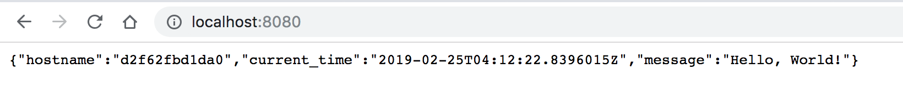
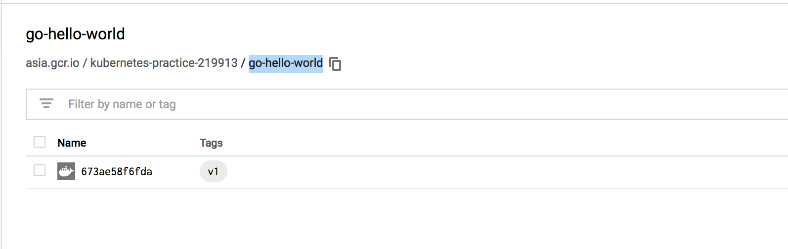
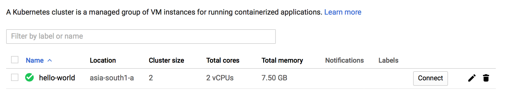
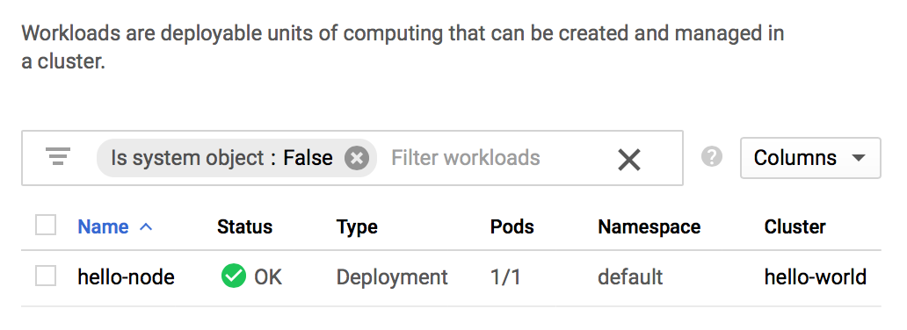
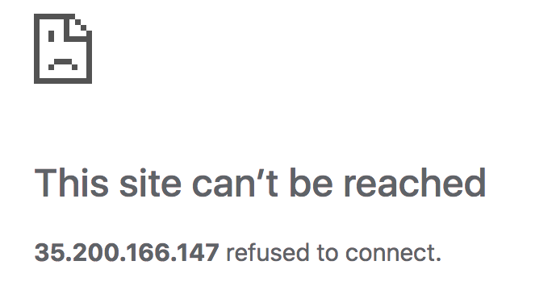
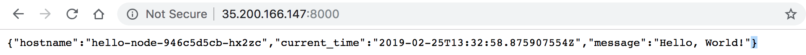
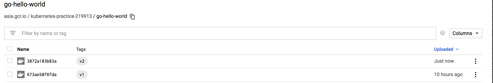

## Prep
List the active account and project:
```sh
$ gcloud auth list
   Credentialed Accounts
ACTIVE  ACCOUNT
*       xxxxxxxxxx@gmail.com

To set the active account, run:
    $ gcloud config set account `ACCOUNT`

$ gcloud config list project 
[core]
project = kubernetes-practice-219913

Your active configuration is: [default]
```

List the default/current config values (I wanted the zone and region details):
```sh
$ gcloud config configurations list

NAME     IS_ACTIVE  ACCOUNT               PROJECT                     DEFAULT_ZONE   DEFAULT_REGION
default  True       xxxxxxxxxx@gmail.com  kubernetes-practice-219913  asia-south1-a  asia-south1
```

## Docker operations

Build a docker image for the hello world app:
```sh
$ docker build -t asia.gcr.io/kubernetes-practice-219913/go-hello-world:v1 .
```
Test run the app:
```sh
$ docker run -p 8080:8000 --name my-golang-app asia.gcr.io/kubernetes-practice-219913/go-hello-world:v1
```
All looks good for now:

Push the image to the Google Container Registry
```
$ docker push asia.gcr.io/kubernetes-practice-219913/go-hello-world:v1
```
The image is uploaded to the Google Container Registry as well:


Check details of the image (CLI) available in the Google Container registry:
```sh
$ gcloud container images list --repository=asia.gcr.io/kubernetes-practice-219913
NAME
asia.gcr.io/kubernetes-practice-219913/go-hello-world

$ gcloud container images list-tags asia.gcr.io/kubernetes-practice-219913/go-hello-world
DIGEST        TAGS  TIMESTAMP
673ae58f6fda  v1    2019-02-25T09:39:36
```

## Kubernetes


### Create the cluster

Question: 
> How do I point the kubectl installed on my local machine to the `gcloud` cluster?

Answer (from the documentation):
> When you create a cluster using `gcloud container clusters create`, an entry is automatically added to the `kubeconfig` in your environment, and the current context changes to that cluster. This works only if you are creating the cluster from your local machine.

Spin up the 2 node cluster:
```sh
# n1-standard-1: Standard machine type with 1 vCPU and 3.75 GB of memory.
# zone: I am launching the cluster in the zone same as my project. Also, it is in the same region that the image is also uploaded.
$ gcloud container clusters create hello-world \
                --num-nodes 2 \
                --machine-type n1-standard-1 \
                --zone asia-south1-a
```
Got the following error:
> ERROR: (`gcloud.container.clusters.create`) ResponseError: code=403, message=Kubernetes Engine API is not enabled for this project. Please ensure it is enabled in Google Cloud Console and try again: visit https://console.cloud.google.com/apis/api/container.googleapis.com/overview?xxxxxxxxxxxxxxx to do so.

I enabled the `Kubernetes Engine API` from the UI and ran the command again. The console output looks something like below:
```sh
# Creating cluster hello-world in asia-south1-a... 
# Cluster is being health-checked (master is healthy)...done.                                                 
# Created [https://container.googleapis.com/v1/projects/kubernetes-practice-219913/zones/asia-south1-a/clusters/hello-world].
# To inspect the contents of your cluster, go to: https://console.cloud.google.com/kubernetes/workload_/gcloud/asia-south1-a/hello-world?project=kubernetes-practice-219913

kubeconfig entry generated for hello-world.
NAME         LOCATION       MASTER_VERSION  MASTER_IP      MACHINE_TYPE   NODE_VERSION  NUM_NODES  STATUS
hello-world  asia-south1-a  1.11.7-gke.4    35.244.37.152  n1-standard-1  1.11.7-gke.4  2          RUNNING
```
The `Kubernetes Engine => Clusters` UI looks like the following:


### Create the Deployment
Creating a deployment also creates pods and deploys them across the nodes.

Check `kubectl`s current context
```sh
# Check the complete list od contexts along withe other details
$ kubectl config view

# Check the current context
$ kubectl config current-context
gke_kubernetes-practice-219913_asia-south1-a_hello-world

# Create the deployment
$ kubectl run hello-node \
    --image=asia.gcr.io/kubernetes-practice-219913/go-hello-world:v1 \
    --port=8080

deployment.apps/hello-node created
```

Got the following warning as well (need to check this out later):
> `kubectl run --generator=deployment/apps.v1beta1` is DEPRECATED and will be removed in a future version. Use `kubectl create` instead.

The GKE => Workloads UI now looks like this:


Check some basic details
```sh
# List the nodes
$ kubectl cluster-info
# Kubernetes master is running at https://35.244.37.152
# GLBCDefaultBackend is running at https://35.244.37.152/api/v1/namespaces/kube-system/services/default-http-backend:http/proxy
# Heapster is running at https://35.244.37.152/api/v1/namespaces/kube-system/services/heapster/proxy
# KubeDNS is running at https://35.244.37.152/api/v1/namespaces/kube-system/services/kube-dns:dns/proxy
# Metrics-server is running at https://35.244.37.152/api/v1/namespaces/kube-system/services/https:metrics-server:/proxy

To further debug and diagnose cluster problems, use 'kubectl cluster-info dump'.

# List the nodes
$ kubectl get nodes
NAME                                         STATUS   ROLES    AGE   VERSION
gke-hello-world-default-pool-15477176-13p4   Ready    <none>   27m   v1.11.7-gke.4
gke-hello-world-default-pool-15477176-9bkn   Ready    <none>   27m   v1.11.7-gke.4

# List the deployment
$ kubectl get deployments
NAME         DESIRED   CURRENT   UP-TO-DATE   AVAILABLE   AGE
hello-node   1         1         1            1           10m

# and the pods
$ kubectl get pods
NAME                          READY   STATUS    RESTARTS   AGE
hello-node-57886b996d-65m8b   1/1     Running   0          10m

# troubleshooting
$ kubectl get events 
$ kubectl logs <pod-name>
```

### Allow external traffic via Services

Expose the deployment
```sh
$ kubectl expose deployment hello-node --type="LoadBalancer"
service/hello-node exposed
```

The Kubernetes master detects the `--type="LoadBalancer"` flag and creates the load-balancer provided by the underlying infrastructure (in this case the Compute Engine load balancer). Since the deployment (not the pod(s) directly) is exposed, the service will load balance traffic across all pods managed by the deployment (for now 1 pod).

The Kubernetes master also creates relevant Compute Engine forwarding rules, target pools, and firewall rules to make the service fully accessible from outside of Google Cloud Platform.

```sh
# List the services
$ kubectl get services
NAME         TYPE           CLUSTER-IP     EXTERNAL-IP      PORT(S)          AGE
hello-node   LoadBalancer   10.19.248.36   35.200.166.147   8080:30094/TCP   7m
kubernetes   ClusterIP      10.19.240.1    <none>           443/TCP          46m
```

Pointing my browser to 35.200.166.147:8080 gives me this:



The docker image exposes port 8000, however my deployment is telling the service to poll at port 8080. I am going to try to modify the port to 8000 in the deployment and see if it works.
```sh
$ kubectl edit deployments hello-node
spec:
  ....
  template:
    ....
    spec:
      containers:
      ....
        ports:
        - containerPort: 8080 # Changes this to 8000
        ....

# the deployment edit is automatically detected and applied to the pods 
deployment.extensions/hello-node edited

# Delete and re-create/expose the deployment
$ kubectl delete service hello-node
service "hello-node" deleted

$ $ kubectl expose deployment hello-node --type="LoadBalancer"
service/hello-node exposed
```

Yippy! The service is up and running :D


### Scaling up

```sh
# Instructs the replication controller to update the number of pods
$ kubectl scale deployment --replicas=4 hello-node
deployment.extensions/hello-node scaled

# Check the number of pods
$ kubectl get pods
NAME                         READY   STATUS              RESTARTS   AGE
hello-node-946c5d5cb-cqlj4   1/1     Running             0          21s
hello-node-946c5d5cb-f8zs4   0/1     ContainerCreating   0          21s
hello-node-946c5d5cb-hx26m   1/1     Running             0          21s
hello-node-946c5d5cb-hx2zc   1/1     Running             0          8h

# List the deployment as well
$ kubectl get deployments.
NAME         DESIRED   CURRENT   UP-TO-DATE   AVAILABLE   AGE
hello-node   4         4         4            4           8h
```

Multiple `curl`s to `35.200.166.147:8000` throws different results:
```sh
$ curl 35.200.166.147:8000
{"hostname":"hello-node-946c5d5cb-hx2zc","current_time":"2019-02-25T14:35:14.916556154Z","message":"Hello, World!"}

{"hostname":"hello-node-946c5d5cb-cqlj4","current_time":"2019-02-25T14:37:02.407322405Z","message":"Hello, World!"}

{"hostname":"hello-node-946c5d5cb-hx26m","current_time":"2019-02-25T14:37:18.8091839Z","message":"Hello, World!"}
```

### Rolling out an upgrade
```sh
# Modified the go hello-world program to return an additional key `service_port`
# which picks up the value of the environment variable HELLO_NODE_SERVICE_PORT from
# the running pod

# Build the new image
$ docker build -t asia.gcr.io/kubernetes-practice-219913/go-hello-world:v2 .

# Push the image to Google Container Registry
$ docker push asia.gcr.io/kubernetes-practice-219913/go-hello-world:v2

# The new tags are appearing in the listing as well
$ gcloud container images list-tags asia.gcr.io/kubernetes-practice-219913/go-hello-world
DIGEST        TAGS  TIMESTAMP
3872a103b83a  v2    2019-02-25T20:21:33
673ae58f6fda  v1    2019-02-25T09:39:36
```

Yup! I can see that the new image has been uploaded:


Edit the deployment config YAML and update the image tag at `spec.template.spec.containers.image`
```sh
$ kubectl edit deployments hello-node
spec:
  ....
  template:
    ....
    spec:
      containers:
      - image: asia.gcr.io/kubernetes-practice-219913/go-hello-world:v1 # Modify v1 to v2

# Edit, save and quit (:wq)
deployment.extensions/hello-node edited

# Listing the deployment that the image tag version has been updated
$ kubectl get deployments -o wide
NAME         DESIRED   CURRENT   UP-TO-DATE   AVAILABLE   AGE   CONTAINERS   IMAGES                                                     SELECTOR
hello-node   4         4         4            4           9h    hello-node   asia.gcr.io/kubernetes-practice-219913/go-hello-world:v2   run=hello-node

# Curl results, there is now an extra parameter 'service_port'
$ curl 35.200.166.147:8000
{"hostname":"hello-node-56855f7579-bccww","current_time":"2019-02-25T15:03:13.491607518Z","message":"Hello, World!","service_port":"8000"}
```

### Clean up time
```sh
# Before clean-up, list all the pods. I can see how the 4 pods are deployed across the 2 nodes. Not relevant, but interesting.
$ kubectl get pods -o wide
NAME                          READY   STATUS    RESTARTS   AGE   IP           NODE                                         NOMINATED NODE
hello-node-56855f7579-8jklg   1/1     Running   0          5m    10.16.1.11   gke-hello-world-default-pool-15477176-13p4   <none>
hello-node-56855f7579-bccww   1/1     Running   0          5m    10.16.1.12   gke-hello-world-default-pool-15477176-13p4   <none>
hello-node-56855f7579-mw8m8   1/1     Running   0          5m    10.16.0.12   gke-hello-world-default-pool-15477176-9bkn   <none>
hello-node-56855f7579-sgwqj   1/1     Running   0          5m    10.16.0.11   gke-hello-world-default-pool-15477176-9bkn   <none>

# Delete the service. curl 35.200.166.147:8000 won't work anymore
$ kubectl delete services hello-node

# Delete the deployment
$ kubectl delete deployments hello-node
deployment.extensions "hello-node" deleted

# List the gcloud k8s cluster we had created
$ gcloud container clusters list 
NAME         LOCATION       MASTER_VERSION  MASTER_IP      MACHINE_TYPE   NODE_VERSION  NUM_NODES  STATUS
hello-world  asia-south1-a  1.11.7-gke.4    35.244.37.152  n1-standard-1  1.11.7-gke.4  2          RUNNING

# And delete them
$ gcloud container clusters delete hello-world
The following clusters will be deleted.
 - [hello-world] in [asia-south1-a]

Do you want to continue (Y/n)?  Y

Deleting cluster hello-world...done.                                                                                                                         
Deleted [https://container.googleapis.com/v1/projects/kubernetes-practice-219913/zones/asia-south1-a/clusters/hello-world].

# Delete all images uploaded to GCR
$ gcloud container images delete asia.gcr.io/kubernetes-practice-219913/go-hello-world:v1 --force-delete-tags
$ gcloud container images delete asia.gcr.io/kubernetes-practice-219913/go-hello-world:v2 --force-delete-tags
# Confirm all's gone
$ gcloud container images list-tags asia.gcr.io/kubernetes-practice-219913/go-hello-world
Listed 0 items.

# Clean up local docker containers, images etc.
$ docker container rm my-golang-app 
$ docker image rm asia.gcr.io/kubernetes-practice-219913/go-hello-world:v1 asia.gcr.io/kubernetes-practice-219913/go-hello-world:v2 
$ docker image rm golang:1.8
```

## Useful resources:

* [`gcloud`: Container Registry | Managing images][1]
* [`gcloud`: Pushing and pulling images][2]
* [`gcloud`: Compute Engine | Machine Types][3]

[1]: https://cloud.google.com/container-registry/docs/managing
[2]: https://cloud.google.com/container-registry/docs/pushing-and-pulling
[3]: https://cloud.google.com/compute/docs/machine-types