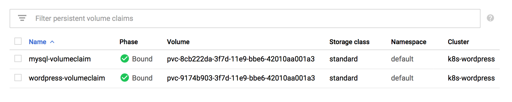
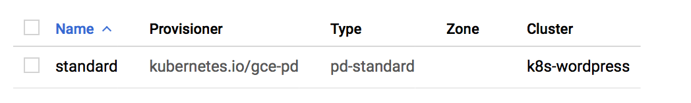
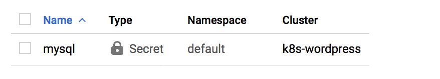
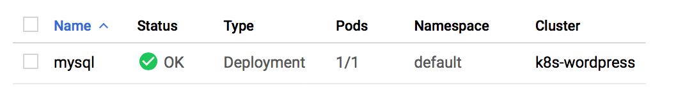
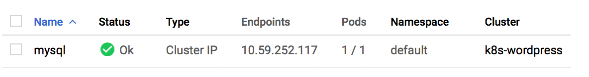
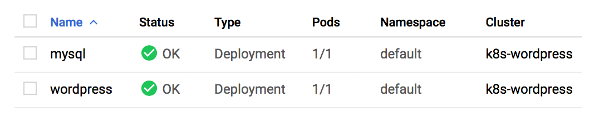
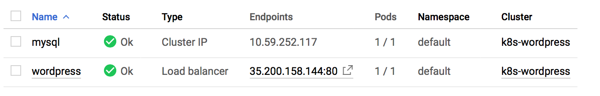
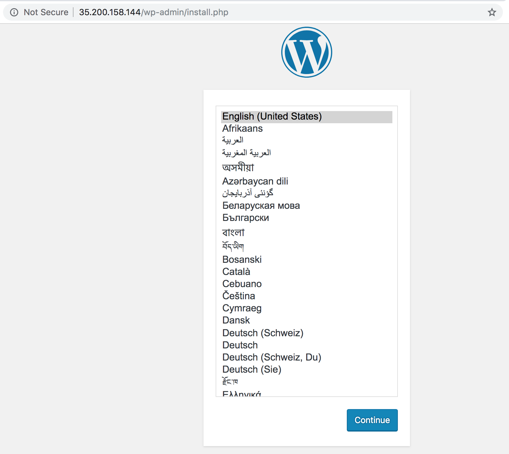

## Using Persistent Disks with WordPress and MySQL

This journal records me working through the exercise at [Kubernetes Engine Tutorials => Using Persistent Disks with WordPress and MySQL][1].

The objective is to set up a single-replica WordPress deployment and a single-replica MySQL database on a GCE cluster, both using PersistentVolumes (PV) and PersistentVolumeClaims (PVC) to store/persist data beyond their pod's lifecycle.

The default [`StorageClass`][2](I don't really what this means, yet) dynamically creates [persistent disks][3] (I think these are equivalent to [EBS in AWS][4]) and create two PersistentVolumeClaims - one for each Deployment, WordPress and MySQL.

**Important** (Copy-Paste from the tutorial):
> Deployments are designed for stateless workloads. If a Deployment uses a persistent disk, it cannot scale beyond one replica, as persistent disks can be attached to only a single instance at a time in read/write mode. To scale past one instance, use a [StatefulSet][5], which attaches a different disk to each member of the set.

### Check config details
```sh
# List the active accounts:
$ gcloud auth list 
   Credentialed Accounts
ACTIVE  ACCOUNT
*       xxyyzz@gmail.com

To set the active account, run:
    $ gcloud config set account `ACCOUNT`

# Checkout the project we are currently in
$ gcloud config list project 
[core]
project = kubernetes-practice-219913

Your active configuration is: [default]

# List the default/current config values (I wanted the zone and region details):
$ gcloud config configurations list
NAME     IS_ACTIVE  ACCOUNT               PROJECT                     DEFAULT_ZONE   DEFAULT_REGION
default  True       xxyyzz@gmail.com  kubernetes-practice-219913  asia-south1-a  asia-south1
```

### Spin-up a k8s cluster (GKE)
```sh
# Create a 3-node cluster and set kubectl context
$ gcloud container clusters create k8s-wordpress --num-nodes=3

kubeconfig entry generated for k8s-wordpress.
NAME           LOCATION       MASTER_VERSION  MASTER_IP       MACHINE_TYPE   NODE_VERSION  NUM_NODES  STATUS
k8s-wordpress  asia-south1-a  1.11.7-gke.4    35.200.213.246  n1-standard-1  1.11.7-gke.4  3          RUNNING
```

Creating a GKE cluster using `gcloud` automatically makes an entry in the kubconfig file and also set the current context for `kubectl`. Let's verify:
```sh
# Get all clusters the local kubectl instance has accesses to. Pay attention the listing gke_kubernetes-practice-219913_asia-south1-a_k8s-wordpress
$ kubectl config get-clusters
NAME
docker-for-desktop-cluster
gke_kubernetes-practice-219913_asia-south1-a_k8s-wordpress
minikube

# Checkout all the the existing context. You can use `gcloud config view` as well.
$ kubectl config get-contexts
CURRENT   NAME                                                         CLUSTER                                                      AUTHINFO                                                     NAMESPACE
          docker-for-desktop                                           docker-for-desktop-cluster                                   docker-for-desktop                                           
*         gke_kubernetes-practice-219913_asia-south1-a_k8s-wordpress   gke_kubernetes-practice-219913_asia-south1-a_k8s-wordpress   gke_kubernetes-practice-219913_asia-south1-a_k8s-wordpress   
          minikube                                                     minikube                                                     minikube                                                     

# And the current context is set to:
$ kubectl config current-context
gke_kubernetes-practice-219913_asia-south1-a_k8s-wordpress
```
To use an existing GKE cluster, use the following command `gcloud container clusters get-credentials [cluster-name]`.

### Create `PersistentVolumes` and `PersistentVolumeClaims`

Important points to remember:
* When a `PersistentVolumeClaim` is created, if there is no existing `PersistentVolume` for it to bind to, k8s dynamically provisions a new `PersistentVolume` based on the `StorageClass` configuration.
* When a `StorageClass` is not specified in the `PersistentVolumeClaim`, the cluster's default `StorageClass` is used instead.
* GKE(GKE) has a default `StorageClass` installed that dynamically provisions `PersistentVolumes` backed by [persistent disks][3].

The `mysql-volumeclaim.yaml` file would like the following:
```yaml
kind: PersistentVolumeClaim
apiVersion: v1
metadata:
  name: mysql-volumeclaim
spec:
  accessModes:
    - ReadWriteOnce
  resources:
    requests:
      storage: 200Gi
```
and the `wordpress-volumeclaim.yaml`:
```yaml
kind: PersistentVolumeClaim
apiVersion: v1
metadata:
  name: wordpress-volumeclaim
spec:
  accessModes:
    - ReadWriteOnce
  resources:
    requests:
      storage: 200Gi
```
Now:
```sh
# deploy the two PersistentVolumeClaim manifests
$ kubectl apply -f pvcs/mysql-volumeclaim.yaml
persistentvolumeclaim/mysql-volumeclaim created

$ kubectl apply -f pvcs/wordpress-volumeclaim.yaml
persistentvolumeclaim/wordpress-volumeclaim created

# List out the [PersistentVolumeClaim]s
$ kubectl get pvc
NAME                    STATUS   VOLUME                                     CAPACITY   ACCESS MODES   STORAGECLASS   AGE
mysql-volumeclaim       Bound    pvc-8cb222da-3f7d-11e9-bbe6-42010aa001a3   200Gi      RWO            standard       12m
wordpress-volumeclaim   Bound    pvc-9174b903-3f7d-11e9-bbe6-42010aa001a3   200Gi      RWO            standard       12m

# And of course, the volumes themselves
$ kubectl get persistentvolumes
NAME                                       CAPACITY   ACCESS MODES   RECLAIM POLICY   STATUS   CLAIM                           STORAGECLASS   REASON   AGE
pvc-8cb222da-3f7d-11e9-bbe6-42010aa001a3   200Gi      RWO            Delete           Bound    default/mysql-volumeclaim       standard                25m
pvc-9174b903-3f7d-11e9-bbe6-42010aa001a3   200Gi      RWO            Delete           Bound    default/wordpress-volumeclaim   standard                25m
```

A look at the `GKE => Storage` UI section:


And the default `storageClass` provided by the uderlying cloud provider (GCP => Persistent Disks):


### Set up MySQL

Get ready with the secrets, this will be passed on to the MySQL docker container.
```sh
# Create a secret for MySQL DB root password:
$ kubectl create secret generic mysql --from-literal=password=dbpassword
secret/mysql created

# List the secrets
$ kubectl get secrets
NAME                  TYPE                                  DATA   AGE
default-token-lk5xg   kubernetes.io/service-account-token   3      1h
mysql                 Opaque                                1      28s
```

You can see this created in the UI as well (`GKE => Configurations`):


Time to start with the MySQL deployment. The MySQL deployment manifest file `mysql.yaml` would like the following:
```yaml
apiVersion: apps/v1
kind: Deployment
metadata:
  name: mysql
  labels:
    app: mysql
spec:
  replicas: 1
  selector:
    matchLabels:
      app: mysql
  template:
    metadata:
      labels:
        app: mysql
    spec:
      containers:
        - image: mysql:5.6
          name: mysql
          env:
            - name: MYSQL_ROOT_PASSWORD
              valueFrom:
                secretKeyRef:
                  name: mysql
                  key: password
          ports:
            - containerPort: 3306
              name: mysql
          volumeMounts:
            - name: mysql-persistent-storage
              mountPath: /var/lib/mysql
      volumes:
        - name: mysql-persistent-storage
          persistentVolumeClaim:
            claimName: mysql-volumeclaim
```

Create the deployment:
```sh
#
$ kubectl create -f deployments/mysql.yaml
deployment.apps/mysql created

# List the deployments
$ kubectl get deployments.
NAME    DESIRED   CURRENT   UP-TO-DATE   AVAILABLE   AGE
mysql   1         1         1            1           57s

# List pods
$ kubectl get pods -l app=mysql
NAME                     READY   STATUS    RESTARTS   AGE
mysql-5bfd5f74dd-mbbf5   1/1     Running   0          2m
```
The `GCP UI => GKE => Workloads` UI:


### Expose the MySQL deployment via Services

The service manifest file (`mysql-service.yaml`) for exposing the MySQL deployment looks like the following:
```yaml
apiVersion: v1
kind: Service
metadata:
  name: mysql
  labels:
    app: mysql
spec:
  type: ClusterIP
  ports:
    - port: 3306
  selector:
    app: mysql
```

Then:
```sh
# Deploy the service
$ kubectl create -f services/mysql-service.yaml
service/mysql created

# List the service
$ kubectl get service
NAME         TYPE        CLUSTER-IP      EXTERNAL-IP   PORT(S)    AGE
kubernetes   ClusterIP   10.59.240.1     <none>        443/TCP    3h
mysql        ClusterIP   10.59.252.117   <none>        3306/TCP   21s
```
`GKE => Services` UI:


### Set up WordPress

Deploy wordpress using the `wordpress.yaml` manifest file:
```yaml
apiVersion: apps/v1
kind: Deployment
metadata:
  name: wordpress
  labels:
    app: wordpress
spec:
  replicas: 1
  selector:
    matchLabels:
      app: wordpress
  template:
    metadata:
      labels:
        app: wordpress
    spec:
      containers:
        - image: wordpress
          name: wordpress
          env:
          - name: WORDPRESS_DB_HOST
            value: mysql:3306
          - name: WORDPRESS_DB_PASSWORD
            valueFrom:
              secretKeyRef:
                name: mysql
                key: password
          ports:
            - containerPort: 80
              name: wordpress
          volumeMounts:
            - name: wordpress-persistent-storage
              mountPath: /var/www/html
      volumes:
        - name: wordpress-persistent-storage
          persistentVolumeClaim:
            claimName: wordpress-volumeclaim
```

Pay attention to the value set for the `env` variable `WORDPRESS_DB_HOST`: `mysql:3306`.
> We can refer to the database as `mysql`, because of [Kubernetes DNS][6] allows `Pods` to communicate a `Service` by its name.

```sh
# Deploy
$ kubectl create -f deployments/wordpress.yaml
deployment.apps/wordpress created

# List the deployments
$ kubectl get deployments -o wide
NAME        DESIRED   CURRENT   UP-TO-DATE   AVAILABLE   AGE   CONTAINERS   IMAGES      SELECTOR
mysql       1         1         1            1           7h    mysql        mysql:5.6   app=mysql
wordpress   1         1         1            1           1m    wordpress    wordpress   app=wordpress

# And Pods
$ kubectl get pod -l app=wordpress
NAME                         READY   STATUS    RESTARTS   AGE
wordpress-78c9b8d684-6r295   1/1     Running   0          2m
```

Time to expose the wordpress service now:
```yaml
apiVersion: v1
kind: Service
metadata:
  labels:
    app: wordpress
  name: wordpress
spec:
  type: LoadBalancer
  ports:
    - port: 80
      targetPort: 80
      protocol: TCP
  selector:
    app: wordpress
```
Go ahead and deploy:

```sh
# Deploy/Create the Service
$ kubectl create -f services/wordpress-service.yaml
service/wordpress created

# List
$ kubectl get service -o wide
NAME         TYPE           CLUSTER-IP      EXTERNAL-IP   PORT(S)        AGE   SELECTOR
kubernetes   ClusterIP      10.59.240.1     <none>        443/TCP        10h   <none>
mysql        ClusterIP      10.59.252.117   <none>        3306/TCP       6h    app=mysql
wordpress    LoadBalancer   10.59.240.86    <pending>     80:32689/TCP   40s   app=wordpress

# Narrow down the listing with labels
$ kubectl get service -o wide -l app=wordpress
NAME        TYPE           CLUSTER-IP     EXTERNAL-IP      PORT(S)        AGE   SELECTOR
wordpress   LoadBalancer   10.59.240.86   35.200.158.144   80:32689/TCP   1m    app=wordpress
```

An unnecessary verification in the GKE UI:

Workloads:


Services:


### Checkout the new WordPress blog

Navigating to `35.200.158.144` presents you with the following:


Created a sample blog (found the image on reddit 😂):


### Data persistence on failure

```sh
# List out all the pods
$ kubectl get pods -o wide
NAME                         READY   STATUS    RESTARTS   AGE   IP          NODE                                           NOMINATED NODE
mysql-5bfd5f74dd-mbbf5       1/1     Running   0          7h    10.56.1.6   gke-k8s-wordpress-default-pool-dda7aa74-lpf1   <none>
wordpress-78c9b8d684-6r295   1/1     Running   0          44m   10.56.2.5   gke-k8s-wordpress-default-pool-dda7aa74-mvc4   <none>

# Delete the mysql pods (can take a few seconds)
$ kubectl delete pods -l app=mysql
pod "mysql-5bfd5f74dd-mbbf5" deleted

# Listing out pods again shows that a new one is immediately created
$ kubectl get pods -o wide
NAME                         READY   STATUS    RESTARTS   AGE   IP          NODE                                           NOMINATED NODE
mysql-5bfd5f74dd-7r6sx       1/1     Running   0          33s   10.56.1.7   gke-k8s-wordpress-default-pool-dda7aa74-lpf1   <none>
wordpress-78c9b8d684-6r295   1/1     Running   0          45m   10.56.2.5   gke-k8s-wordpress-default-pool-dda7aa74-mvc4   <none>
```

The dummy blog that I created is still up!


I am liking this! :)

### Updating the image application
is as simple as this:
1. Checkout the newest version from Docker hub
2. Open the relevant deployment manifest file
3. Update the `image:tag` value under `spec.template.spec.containers.image`
4. Deploy the changes using `kubectl apply -f wordpress.yaml`

[1]: https://cloud.google.com/kubernetes-engine/docs/tutorials/persistent-disk
[2]: https://kubernetes.io/docs/concepts/storage/storage-classes/
[3]: https://cloud.google.com/persistent-disk/
[4]: https://aws.amazon.com/ebs/
[5]: https://kubernetes.io/docs/tutorials/stateful-application/basic-stateful-set/
[6]: https://kubernetes.io/docs/concepts/services-networking/dns-pod-service/