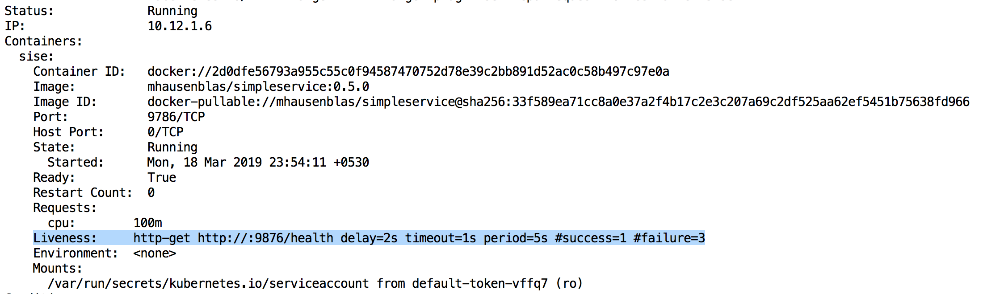
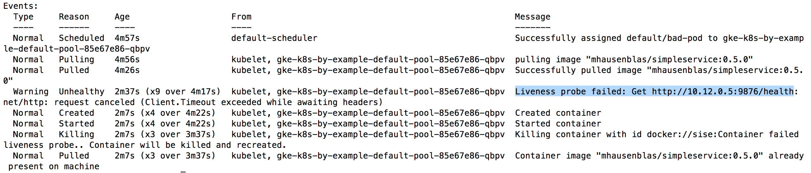
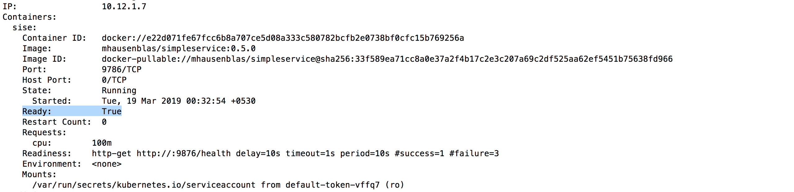

## Kubernetes By Example

This is a journal of me walking through the entire [Kubernetes By Example][1] exercises on `Google Kubernetes Engine`. Here's their [GitHub repository][2].

1. [Check config details](#check-config-details)
2. [Spin-up a k8s cluster (GKE)](#spin-up-a-k8s-cluster-(gke))
3. [Pods](#pods)
4. [Labels](#labels)
5. [Deployments](#deployments)
6. [Services](#services)
7. [Service Discovery](#service-discovery)
8. [Port Forward](#port-forward)
9. [Health Checks](#health-checks)
10. [Environment Variables](#environment-variables)
11. [Namespaces](#namespaces)
12. [Volumes](#volumes)
13. [Secrets](#secrets)
14. [Logging](#logging)

### Check config details
```sh
# List the active accounts:
$ gcloud auth list
   Credentialed Accounts
ACTIVE  ACCOUNT
*       xxyyzz@gmail.com

To set the active account, run:
    $ gcloud config set account `ACCOUNT`

# Checkout the project we are currently in
$ gcloud config list project 
[core]
project = kubernetes-practice-219913

Your active configuration is: [default]

# List the default/current config values (I wanted the zone and region details):
$ gcloud config configurations list
NAME     IS_ACTIVE  ACCOUNT               PROJECT                     DEFAULT_ZONE   DEFAULT_REGION
default  True       xxyyzz@gmail.com  kubernetes-practice-219913  asia-south1-a  asia-south1
```

### Spin-up a k8s cluster (GKE)

```sh
# Create a 3-node cluster and set kubectl context
$ gcloud container clusters create k8s-by-example --num-nodes=3

# Creating cluster k8s-by-example in asia-south1-a... Cluster is being health-checked (master is healthy)...done.                                              
# Created [https://container.googleapis.com/v1/projects/kubernetes-practice-219913/zones/asia-south1-a/clusters/k8s-by-example].
# To inspect the contents of your cluster, go to: https://console.cloud.google.com/kubernetes/workload_/gcloud/asia-south1-a/k8s-by-example?project=kubernetes-practice-219913

kubeconfig entry generated for k8s-by-example.
NAME            LOCATION       MASTER_VERSION  MASTER_IP       MACHINE_TYPE   NODE_VERSION  NUM_NODES  STATUS
k8s-by-example  asia-south1-a  1.11.7-gke.4    35.200.190.186  n1-standard-1  1.11.7-gke.4  3          RUNNING
```

Creating a GKE cluster using `gcloud` automatically makes an entry in the kubconfig file and also set the current context for `kubectl`.

### Pods

> A pod is a collection of containers sharing a network and mount namespace and is the basic unit of deployment in Kubernetes. All containers in a pod are scheduled on the same node.

A dry-run `kubectl run sise --image=mhausenblas/simpleservice:0.5.0 --port=9876 --dry-run=true -o yaml`, gives the following yaml output:

```yaml
apiVersion: apps/v1beta1
kind: Deployment
metadata:
  creationTimestamp: null
  labels:
    run: sise
  name: sise
spec:
  replicas: 1
  selector:
    matchLabels:
      run: sise
  strategy: {}
  template:
    metadata:
      creationTimestamp: null
      labels:
        run: sise
    spec:
      containers:
      - image: mhausenblas/simpleservice:0.5.0
        name: sise
        ports:
        - containerPort: 9876
        resources: {}
status: {}
```

Let's run the pod using the image `mhausenblas/simpleservice:0.5.0`:
```sh
$ kubectl run sise --image=mhausenblas/simpleservice:0.5.0 --port=9876
kubectl run --generator=deployment/apps.v1beta1 is DEPRECATED and will be removed in a future version. Use kubectl create instead.
deployment.apps/sise created

# List out the pod
$ kubectl get po -o wide
NAME                   READY   STATUS    RESTARTS   AGE   IP          NODE                                            NOMINATED NODE
sise-bf8d99689-qgkkk   1/1     Running   0          43s   10.12.1.6   gke-k8s-by-example-default-pool-f7f7edae-09cs   <none>

# Grab the IP address
$ kubectl describe pods sise-bf8d99689-qgkkk | grep IP
IP:                 10.12.1.6

# Get inside the pod and access the API using the IP address.
# This is accessible from the cluster as well
$ kubectl exec -it sise-bf8d99689-qgkkk sh
> curl localhost:9876/info
{"host": "localhost:9876", "version": "0.5.0", "from": "127.0.0.1"}# 

> curl 10.12.1.6:9876/info
{"host": "10.12.1.6:9876", "version": "0.5.0", "from": "10.12.1.6"}# 

# List the deployments
$ kubectl get deployments.
NAME   DESIRED   CURRENT   UP-TO-DATE   AVAILABLE   AGE
sise   1         1         1            1           20m

# And delete it
$ kubectl delete deployments sise
deployment.extensions "sise" deleted
```

#### Using a configuration file
```sh
# Apply a configuration to a resource by filename or stdin. The resource name must be specified. This resource will be created if it doesn't exist yet. JSON and YAML formats are accepted.
$ kubectl apply -f pod/pod.yaml
pod/twocontainers created

# List the pods
$ kubectl get pods -o wide
NAME            READY   STATUS    RESTARTS   AGE   IP          NODE                                            NOMINATED NODE
twocontainers   2/2     Running   0          1m    10.12.1.7   gke-k8s-by-example-default-pool-f7f7edae-09cs   <none>

# Get inside the container named 'shell' within the pod named 'twocontainers'
$ kubectl exec -it twocontainers -c shell -- bash
[root@twocontainers /]# curl localhost:9876/info
{"host": "localhost:9876", "version": "0.5.0", "from": "127.0.0.1"}

[root@twocontainers /]# curl 10.12.1.7:9876/info
{"host": "10.12.1.7:9876", "version": "0.5.0", "from": "10.12.1.7"}

# Clean up
$ kubectl delete pods twocontainers
pod "twocontainers" deleted
```

Creating pods with resource limits
```sh
# in the constraint-pod.yaml file:
      resources:
        limits:
          memory: "64Mi" 
          cpu: "500m"

# Create the pod
kubectl apply -f pod/constraint-pod.yaml

# List the pods
$ kubectl get pods
NAME                    READY   STATUS    RESTARTS   AGE
containers-constraint   1/1     Running   0          14m

# Clean up
$ kubectl delete pods containers-constraint
pod "containers-constraint" deleted
```

### Labels

> Labels are the mechanism you use to organize Kubernetes objects. A label is a key-value pair with certain restrictions concerning length and allowed values but without any pre-defined meaning.

```sh
# Create the pod using labels/labels-1.yaml
$ kubectl create -f labels/labels-1.yaml
pod/labelex created

# Check the pods created
$ kubectl get pods
NAME      READY   STATUS             RESTARTS   AGE
labelex   0/1     ImagePullBackOff   0          31s
```

Oops! Looks like I made some mistake while specifying the image for the container. Let me checkout what went wrong using the `describe` command:
```sh
$ kubectl describe pods labelex
Name:               labelex
Namespace:          default
Priority:           0
PriorityClassName:  <none>
Node:               gke-k8s-by-example-default-pool-41076e94-4n53/10.160.0.12
Start Time:         Fri, 15 Mar 2019 18:12:37 +0530
Labels:             env=development
Annotations:        <none>
Status:             Pending
IP:                 10.12.2.8
.
.
.
Events:
  Type     Reason          Age                   From                                                    Message
  ----     ------          ----                  ----                                                    -------
  Normal   Scheduled       5m10s                 default-scheduler                                       Successfully assigned default/labelex to gke-k8s-by-example-default-pool-41076e94-4n53
  Normal   SandboxChanged  5m1s (x2 over 5m3s)   kubelet, gke-k8s-by-example-default-pool-41076e94-4n53  Pod sandbox changed, it will be killed and re-created.
  Normal   Pulling         4m10s (x3 over 5m9s)  kubelet, gke-k8s-by-example-default-pool-41076e94-4n53  pulling image "mhausenblas/simpleservice:0.5."
  Warning  Failed          4m5s (x3 over 5m4s)   kubelet, gke-k8s-by-example-default-pool-41076e94-4n53  Failed to pull image "mhausenblas/simpleservice:0.5.": rpc error: code = Unknown desc = Error response from daemon: manifest for mhausenblas/simpleservice:0.5. not found
  Warning  Failed          4m5s (x3 over 5m4s)   kubelet, gke-k8s-by-example-default-pool-41076e94-4n53  Error: ErrImagePull
  Normal   BackOff         3m26s (x7 over 5m2s)  kubelet, gke-k8s-by-example-default-pool-41076e94-4n53  Back-off pulling image "mhausenblas/simpleservice:0.5."
  Warning  Failed          3s (x19 over 5m2s)    kubelet, gke-k8s-by-example-default-pool-41076e94-4n53  Error: ImagePullBackOff
```

Skimming through the `Events` section I found:

`Failed to pull image "mhausenblas/simpleservice:0.5.": rpc error: code = Unknown desc = Error response from daemon: manifest for mhausenblas/simpleservice:0.5. not found`


Lol! I mentioned the wrong image name(`mhausenblas/simpleservice:0.5.` instead of `mhausenblas/simpleservice:0.5.0`). Let me correct that and apply the changes:

```sh
# This time the image is successfully pulled
$ kubectl describe pods labelex
# Events:
#  Type     Reason          Age                   From                                                    Message
#   ----     ------          ----                  ----                                                    -------
#  Normal   Pulled          68s                   kubelet, gke-k8s-by-example-default-pool-41076e94-4n53  Successfully pulled image "mhausenblas/simpleservice:0.5.0"

# List the pod created
$ kubectl get pods
NAME      READY   STATUS    RESTARTS   AGE
labelex   1/1     Running   0          11m

# Show the labels as well
$ kubectl get pods --show-labels
NAME      READY   STATUS    RESTARTS   AGE   LABELS
labelex   1/1     Running   0          15m   env=development

# Filter by the label now
$ kubectl get pods -l env=development
NAME      READY   STATUS    RESTARTS   AGE
labelex   1/1     Running   0          16m

# Add a label to the pod
$ kubectl label pods labelex ownwer=bensooraj
pod/labelex labeled

# List them out again
$ kubectl get pods --show-labels
NAME      READY   STATUS    RESTARTS   AGE   LABELS
labelex   1/1     Running   0          17m   env=development,ownwer=bensooraj

# Filter by the new label.
$ kubectl get pods --selector ownwer=bensooraj
NAME      READY   STATUS    RESTARTS   AGE
labelex   1/1     Running   0          19m

```
I am really sorry for the spelling mistake with the label `ownwer=bensooraj`. It hurts my eyes.

Anyways, `--selector` and `-l` mean the same thing.

#### Set based selectors

> Kubernetes objects also support set-based selectors

We will launch another pod that has two labels (env=production and owner=bensooraj)
```sh
# Create a new pod using labels/labels-2.yaml
$ kubectl apply -f labels/labels-2.yaml

# List out all the pods along with the labels
$ kubectl get pods --show-labels
NAME       READY   STATUS    RESTARTS   AGE   LABELS
labelex    1/1     Running   0          57m   env=development,ownwer=bensooraj
labelex2   1/1     Running   0          2m    env=production,owner=bensooraj

# Let's get fancy here with selecting the labels
$ kubectl get pods --show-labels -l 'env in (development)'
NAME      READY   STATUS    RESTARTS   AGE   LABELS
labelex   1/1     Running   0          57m   env=development,ownwer=bensooraj

# The following lists all pods that are either labelled with env=development or with env=production
$ kubectl get pods --show-labels -l 'env in (development, production)'
NAME       READY   STATUS    RESTARTS   AGE   LABELS
labelex    1/1     Running   0          57m   env=development,ownwer=bensooraj
labelex2   1/1     Running   0          3m    env=production,owner=bensooraj
```

I can even delete pods like that:
```sh
$ kubectl delete pods -l 'env in (development, production)'
pod "labelex" deleted
pod "labelex2" deleted

# You can see them getting terminated
$ kubectl get pods -w
NAME       READY   STATUS        RESTARTS   AGE
labelex    1/1     Terminating   0          61m
labelex2   1/1     Terminating   0          6m34s
```

### Deployments

> A deployment is a supervisor for pods, giving you fine-grained control over how and when a new pod version is rolled out as well as rolled back to a previous state.

```sh
# Create a deploment called sise-deploy using 
$ kubectl apply -f deployments/deployment-1.yaml
deployment.apps/sise-deployment created

# The deployment has started creating the pods
$ kubectl get pods
NAME                               READY   STATUS              RESTARTS   AGE
sise-deployment-6b9688f8f5-8xgr4   0/1     ContainerCreating   0          25s
sise-deployment-6b9688f8f5-cwlvc   0/1     ContainerCreating   0          25s

# After a while
$ kubectl get pods
NAME                               READY   STATUS    RESTARTS   AGE
sise-deployment-6b9688f8f5-8xgr4   1/1     Running   0          63s
sise-deployment-6b9688f8f5-cwlvc   1/1     Running   0          63s

# Check the deployment as well
$ kubectl get deployments -o wide
NAME              DESIRED   CURRENT   UP-TO-DATE   AVAILABLE   AGE   CONTAINERS   IMAGES                            SELECTOR
sise-deployment   2         2         2            2           3m    sise         mhausenblas/simpleservice:0.5.0   app=sise

# List out the replica sets 
$ kubectl get rs -o wide
NAME                         DESIRED   CURRENT   READY   AGE   CONTAINERS   IMAGES                            SELECTOR
sise-deployment-6b9688f8f5   2         2         2       4m    sise         mhausenblas/simpleservice:0.5.0   app=sise,pod-template-hash=2652449491
```
> Note the naming of the pods and replica set, derived from the deployment name.

Check the app using the pod IPs
```sh
# Get the pod IPs
$ kubectl describe pod sise-deployment-6b9688f8f5-8xgr4 | grep IP
IP:                 10.12.1.6

$ kubectl describe pod sise-deployment-6b9688f8f5-cwlvc | grep IP
IP:                 10.12.2.5
```

SSH into one of the nodes of the cluster: 
* Navigate to `GCE > Compute Engine > VM instances`. Select one of the nodes
* Under the `Connect` (against any one of the nodes), click on the `SSH` drop-down and select `View gcloud command` as shown below:

* You will be presented with a command similar to: `gcloud compute --project "kubernetes-practice-219913" ssh --zone "asia-south1-a" "gke-k8s-by-example-default-pool-5574bdde-7k75"`

```sh
# From within the cluster, access the app running inside the pods
Bensooraj@gke-k8s-by-example-default-pool-5574bdde-7k75 ~ $ curl 10.12.1.6:9876/info
{"host": "10.12.1.6:9876", "version": "0.9", "from": "10.160.0.13"}

Bensooraj@gke-k8s-by-example-default-pool-5574bdde-7k75 ~ $ curl 10.12.2.5:9876/info
{"host": "10.12.2.5:9876", "version": "0.9", "from": "10.160.0.13"}
```

Rolling out an update
```sh
# Update the value of the environment variable SIMPLE_SERVICE_VERSION from "0.9" to "1.0"
$ kubectl apply -f deployments/deployment-2.yaml
deployment.apps/sise-deployment configured

# You can see the roll-out happening
$ kubectl get pods -w
NAME                               READY   STATUS        RESTARTS   AGE
sise-deployment-6b9688f8f5-8xgr4   1/1     Terminating   0          41m
sise-deployment-6b9688f8f5-cwlvc   1/1     Terminating   0          41m
sise-deployment-6c7b7f88c5-8mwr2   1/1     Running       0          16s
sise-deployment-6c7b7f88c5-zxfgm   1/1     Running       0          18s

# After a while
$ kubectl get pods
NAME                               READY   STATUS    RESTARTS   AGE
sise-deployment-6c7b7f88c5-8mwr2   1/1     Running   0          2m
sise-deployment-6c7b7f88c5-zxfgm   1/1     Running   0          2m

# Check out the replication set as well. A new replication set will be created
$ kubectl get rs -w
NAME                         DESIRED   CURRENT   READY   AGE
sise-deployment-6b9688f8f5   0         0         0       42m
sise-deployment-6c7b7f88c5   2         2         2       57s

# Check out the roll-out status
$ kubectl rollout status deployment sise-deployment
deployment "sise-deployment" successfully rolled out
```
Remember, the value change can also be rolled out using the command: `kubectl edit deploy sise-deployment`.


Verify the change made to the value of the environment variable by pinging the app
```sh
# Get the new set of pod IPs
j$ kubectl describe pods sise-deployment-6c7b7f88c5-8mwr2 | grep IP
IP:                 10.12.2.6

$ kubectl describe pods sise-deployment-6c7b7f88c5-zxfgm | grep IP
IP:                 10.12.1.7

# Curl the IPs from the node we SSHed into above
Bensooraj@gke-k8s-by-example-default-pool-5574bdde-7k75 ~ $ curl 10.12.2.6:9876/info
{"host": "10.12.2.6:9876", "version": "1.0", "from": "10.160.0.13"}

Bensooraj@gke-k8s-by-example-default-pool-5574bdde-7k75 ~ $ curl 10.12.1.7:9876/info
{"host": "10.12.1.7:9876", "version": "1.0", "from": "10.160.0.13"}
```

Undo the roll-out
```sh
# Check-out the roll-out history
$ kubectl rollout history deployment sise-deployment
deployment.extensions/sise-deployment 
REVISION  CHANGE-CAUSE
1         <none>
2         <none>

# Undo the roll-out
$ kubectl rollout undo deployment sise-deployment 
deployment.extensions/sise-deployment

# The roll-back has begun
$ kubectl get pods -o wide -w
NAME                               READY   STATUS        RESTARTS   AGE   IP          NODE                                            NOMINATED NODE
sise-deployment-6b9688f8f5-74fnz   1/1     Running       0          8s    10.12.2.7   gke-k8s-by-example-default-pool-5574bdde-gkhk   <none>
sise-deployment-6b9688f8f5-gglnk   1/1     Running       0          10s   10.12.1.8   gke-k8s-by-example-default-pool-5574bdde-dnnl   <none>
sise-deployment-6c7b7f88c5-8mwr2   1/1     Terminating   0          13m   10.12.2.6   gke-k8s-by-example-default-pool-5574bdde-gkhk   <none>
sise-deployment-6c7b7f88c5-zxfgm   1/1     Terminating   0          13m   10.12.1.7   gke-k8s-by-example-default-pool-5574bdde-dnnl   <none>

# List the roll-out history one more time
$ kubectl rollout history deployment sise-deployment
deployment.extensions/sise-deployment 
REVISION  CHANGE-CAUSE
2         <none>
3         <none>

# Get the new IP addresses
$ kubectl describe pods sise-deployment-6b9688f8f5-74fnz | grep IP
IP:                 10.12.2.7

$ kubectl describe pods sise-deployment-6b9688f8f5-gglnk | grep IP
IP:                 10.12.1.8

# Ping the app again from withing the cluster
Bensooraj@gke-k8s-by-example-default-pool-5574bdde-7k75 ~ $ curl 10.12.2.7:9876/info
{"host": "10.12.2.7:9876", "version": "0.9", "from": "10.160.0.13"}

Bensooraj@gke-k8s-by-example-default-pool-5574bdde-7k75 ~ $ curl 10.12.1.8:9876/info
{"host": "10.12.1.8:9876", "version": "0.9", "from": "10.160.0.13"}
```

You can see the version rolled-back from `"version": "1.0"` to `"version": "0.9"`.

Also, you can explicitly roll back to a specific revision using the flag `--to-revision`. For example: `kubectl rollout undo deployment sise-deployment`

Time to clean up!
```sh
$ kubectl delete deployment sise-deployment
deployment.extensions "sise-deployment" deleted

# Pods going down! :P
$ kubectl get pods -w
NAME                               READY   STATUS        RESTARTS   AGE
sise-deployment-6b9688f8f5-74fnz   1/1     Terminating   0          6m27s
sise-deployment-6b9688f8f5-gglnk   1/1     Terminating   0          6m29s
```

### Services

> A service is an abstraction for pods, providing a stable, so called virtual IP (`VIP`) address. While pods may come and go and with it their IP addresses, a service allows clients to reliably connect to the containers running in the pod using the VIP. The `virtual` in VIP means it is not an actual IP address connected to a network interface, but its purpose is purely to forward traffic to one or more pods. Keeping the mapping between the VIP and the pods up-to-date is the job of `kube-proxy`, a process that runs on every node, which queries the API server to learn about new services in the cluster.

Create the ReplicationController from `rc.yaml`:
```sh
$ kubectl apply -f services/rc.yaml

# Check the ReplicationController created
$ kubectl get replicationcontrollers -o wide
NAME      DESIRED   CURRENT   READY   AGE   CONTAINERS   IMAGES                            SELECTOR
rc-sise   2         2         2       50s   rc-sise      mhausenblas/simpleservice:0.5.0   app=rc-sise

# And the pods
$ kubectl get pod --show-labels -o wide
NAME            READY   STATUS    RESTARTS   AGE   IP          NODE                                            NOMINATED NODE   LABELS
rc-sise-24vg4   1/1     Running   0          1m    10.12.1.9   gke-k8s-by-example-default-pool-5574bdde-dnnl   <none>           app=rc-sise
rc-sise-dm4p8   1/1     Running   0          1m    10.12.2.8   gke-k8s-by-example-default-pool-5574bdde-gkhk   <none>           app=rc-sise
```

Create the Service from `svc.yaml`:
```sh
$ kubectl apply -f services/svc.yaml
service/simple-service created

# Get the service
$ kubectl get service -o wide
NAME             TYPE        CLUSTER-IP      EXTERNAL-IP   PORT(S)   AGE   SELECTOR
kubernetes       ClusterIP   10.15.240.1     <none>        443/TCP   3h    <none>
simple-service   ClusterIP   10.15.255.188   <none>        80/TCP    29s   app=rc-sise

# Get the pods
$ kubectl get pods -l app=rc-sise -o wide
NAME            READY   STATUS    RESTARTS   AGE   IP          NODE                                            NOMINATED NODE
rc-sise-24vg4   1/1     Running   0          7m    10.12.1.9   gke-k8s-by-example-default-pool-5574bdde-dnnl   <none>
rc-sise-dm4p8   1/1     Running   0          7m    10.12.2.8   gke-k8s-by-example-default-pool-5574bdde-gkhk   <none>

# Describe one of the pods and grab one of their IPs
$ kubectl describe pods rc-sise-24vg4 | grep IP
IP:                 10.12.1.9

# This can be accessed from one of three nodes running in the cluster
Bensooraj@gke-k8s-by-example-default-pool-5574bdde-7k75 ~ $ curl 10.12.1.9:9876/info
{"host": "10.12.1.9:9876", "version": "0.5.0", "from": "10.160.0.13"}
```

However, remember that pod IPs are ephemeral in nature and exist only as long as the pod exists. So, relying on pod IPs is not the right approach. 

> The service keeps track of the pods it forwards traffic to through the label, in our case `app=sise`.

Let's review the service that we created one more time:
```sh
$ kubectl get svc -o wide
NAME             TYPE        CLUSTER-IP      EXTERNAL-IP   PORT(S)   AGE   SELECTOR
kubernetes       ClusterIP   10.15.240.1     <none>        443/TCP   3h    <none>
simple-service   ClusterIP   10.15.255.188   <none>        80/TCP    6m    app=rc-sise

# Describe them
$ kubectl describe svc simple-service
Name:              simple-service
Namespace:         default
Labels:            <none>
Annotations:       kubectl.kubernetes.io/last-applied-configuration:
                     {"apiVersion":"v1","kind":"Service","metadata":{"annotations":{},"name":"simple-service","namespace":"default"},"spec":{"ports":[{"port":8...
Selector:          app=rc-sise
Type:              ClusterIP
IP:                10.15.255.188
Port:              <unset>  80/TCP
TargetPort:        9876/TCP
Endpoints:         10.12.1.9:9876,10.12.2.8:9876
Session Affinity:  None
Events:            <none>
```

Note that the `Endpoints` are actually pod IPs along with the port on which the application is running.

```sh
# The application can now be accessed using the clusterIP, from within the cluster
Bensooraj@gke-k8s-by-example-default-pool-5574bdde-7k75 ~ $ curl 10.15.255.188/info
{"host": "10.15.255.188", "version": "0.5.0", "from": "10.160.0.13"}
```

> [`IPtables`](https://wiki.centos.org/HowTos/Network/IPTables) makes the VIP `10.15.255.188` forward the traffic to the pods. `IPtables` is a long list of rules that tells the Linux kernel what to do with a certain IP package.

Let's check them out:
```sh
# From within the cluster, that is from within a node(vm) running in the cluster
Bensooraj@gke-k8s-by-example-default-pool-5574bdde-7k75 ~ $ sudo iptables-save | grep simple-service
-A KUBE-SEP-XKHKNSMBAPANOQ3H -s 10.12.1.9/32 -m comment --comment "default/simple-service:" -j KUBE-MARK-MASQ
-A KUBE-SEP-XKHKNSMBAPANOQ3H -p tcp -m comment --comment "default/simple-service:" -m tcp -j DNAT --to-destination 10.12.1.9:9876
-A KUBE-SEP-XRG5PL6H4OXP3HUZ -s 10.12.2.8/32 -m comment --comment "default/simple-service:" -j KUBE-MARK-MASQ
-A KUBE-SEP-XRG5PL6H4OXP3HUZ -p tcp -m comment --comment "default/simple-service:" -m tcp -j DNAT --to-destination 10.12.2.8:9876
-A KUBE-SERVICES ! -s 10.12.0.0/14 -d 10.15.255.188/32 -p tcp -m comment --comment "default/simple-service: cluster IP" -m tcp --dport 80 -j KUBE-MARK-MASQ
-A KUBE-SERVICES -d 10.15.255.188/32 -p tcp -m comment --comment "default/simple-service: cluster IP" -m tcp --dport 80 -j KUBE-SVC-LRSQWG6IZCA6IBBJ
-A KUBE-SVC-LRSQWG6IZCA6IBBJ -m comment --comment "default/simple-service:" -m statistic --mode random --probability 0.50000000000 -j KUBE-SEP-XKHKNSMBAPANOQ3H
-A KUBE-SVC-LRSQWG6IZCA6IBBJ -m comment --comment "default/simple-service:" -j KUBE-SEP-XRG5PL6H4OXP3HUZ
```

I have no clue how to read the above table, however, this is the `kube-proxy` defining rules to allow TCP connections back-n-forth the `ClusterIP` `10.15.255.188` and the pod IPs `10.12.1.9:9876` and `10.12.2.8:9876`.

Let's scale up our `ReplicationController`:
```sh
$ kubectl scale replicationcontroller --replicas=3 rc-sise
replicationcontroller/rc-sise scaled

# Check the pods
$ kubectl get pods --show-labels -o wide -w
NAME            READY   STATUS    RESTARTS   AGE   IP           NODE                                            NOMINATED NODE   LABELS
rc-sise-24vg4   1/1     Running   0          29m   10.12.1.9    gke-k8s-by-example-default-pool-5574bdde-dnnl   <none>           app=rc-sise
rc-sise-dm4p8   1/1     Running   0          29m   10.12.2.8    gke-k8s-by-example-default-pool-5574bdde-gkhk   <none>           app=rc-sise
rc-sise-p7sk9   1/1     Running   0          14s   10.12.1.10   gke-k8s-by-example-default-pool-5574bdde-dnnl   <none>           app=rc-sise
```

We have one more pod IP to handle, `10.12.1.10`.

And guess what? The service `simple-service` has already updated itself to account for the 3rd pod added to the `ReplicationController`.
```sh
# Check the Endpoints key. All the 3 pod IPs are now handled by the service
$ kubectl describe service simple-service 
Name:              simple-service
Namespace:         default
Labels:            <none>
Annotations:       kubectl.kubernetes.io/last-applied-configuration:
                     {"apiVersion":"v1","kind":"Service","metadata":{"annotations":{},"name":"simple-service","namespace":"default"},"spec":{"ports":[{"port":8...
Selector:          app=rc-sise
Type:              ClusterIP
IP:                10.15.255.188
Port:              <unset>  80/TCP
TargetPort:        9876/TCP
Endpoints:         10.12.1.10:9876,10.12.1.9:9876,10.12.2.8:9876
Session Affinity:  None
Events:            <none>
```

Let's also checkout the `IPtables` as well from within the cluster:
```sh
Bensooraj@gke-k8s-by-example-default-pool-5574bdde-7k75 ~ $ sudo iptables-save | grep simple-service
-A KUBE-SEP-O5OGXTSGDHX72GHE -s 10.12.1.10/32 -m comment --comment "default/simple-service:" -j KUBE-MARK-MASQ
-A KUBE-SEP-O5OGXTSGDHX72GHE -p tcp -m comment --comment "default/simple-service:" -m tcp -j DNAT --to-destination 10.12.1.10:9876
-A KUBE-SEP-XKHKNSMBAPANOQ3H -s 10.12.1.9/32 -m comment --comment "default/simple-service:" -j KUBE-MARK-MASQ
-A KUBE-SEP-XKHKNSMBAPANOQ3H -p tcp -m comment --comment "default/simple-service:" -m tcp -j DNAT --to-destination 10.12.1.9:9876
-A KUBE-SEP-XRG5PL6H4OXP3HUZ -s 10.12.2.8/32 -m comment --comment "default/simple-service:" -j KUBE-MARK-MASQ
-A KUBE-SEP-XRG5PL6H4OXP3HUZ -p tcp -m comment --comment "default/simple-service:" -m tcp -j DNAT --to-destination 10.12.2.8:9876
-A KUBE-SERVICES ! -s 10.12.0.0/14 -d 10.15.255.188/32 -p tcp -m comment --comment "default/simple-service: cluster IP" -m tcp --dport 80 -j KUBE-MARK-MASQ
-A KUBE-SERVICES -d 10.15.255.188/32 -p tcp -m comment --comment "default/simple-service: cluster IP" -m tcp --dport 80 -j KUBE-SVC-LRSQWG6IZCA6IBBJ
-A KUBE-SVC-LRSQWG6IZCA6IBBJ -m comment --comment "default/simple-service:" -m statistic --mode random --probability 0.33332999982 -j KUBE-SEP-O5OGXTSGDHX72GHE
-A KUBE-SVC-LRSQWG6IZCA6IBBJ -m comment --comment "default/simple-service:" -m statistic --mode random --probability 0.50000000000 -j KUBE-SEP-XKHKNSMBAPANOQ3H
-A KUBE-SVC-LRSQWG6IZCA6IBBJ -m comment --comment "default/simple-service:" -j KUBE-SEP-XRG5PL6H4OXP3HUZ
```

> ... the traffic to the service is equally split between the three pods by invoking the `statistics` module of `IPtables`.

I think the `--probability` does that.

Alrighty! Time to clean up:
```sh
$ kubectl delete replicationcontrollers rc-sise
replicationcontroller "rc-sise" deleted

$ kubectl delete svc simple-service
service "simple-service" deleted
```
I think it makes more sense to delete the `Service` first and then the `ReplicationController`. I will do that next time.

### Service Discovery

> Service discovery is the process of figuring out how to connect to a service. While there is a service discovery option based on environment variables available, the DNS-based service discovery is preferable. Note that DNS is a cluster add-on so make sure your Kubernetes distribution provides for one or install it yourself.

```sh
# Create the RC from service-discovery/rc.yaml
$ kubectl apply -f service-discovery/rc.yaml
replicationcontroller/rcsise created

# Check the pods
$ kubectl get pods -o wide 
NAME           READY   STATUS    RESTARTS   AGE   IP          NODE                                            NOMINATED NODE
rcsise-mgdc8   1/1     Running   0          56s   10.12.2.6   gke-k8s-by-example-default-pool-dec3a359-jsgl   <none>
rcsise-rwqxt   1/1     Running   0          56s   10.12.1.5   gke-k8s-by-example-default-pool-dec3a359-wrxk   <none>

# Create the service as well using service-discovery/svc.yaml
$ kubectl apply -f service-discovery/svc.yaml
service/thesvc created

# Check the service that we just created
$ kubectl get svc -o wide -w
NAME         TYPE        CLUSTER-IP      EXTERNAL-IP   PORT(S)   AGE    SELECTOR
kubernetes   ClusterIP   10.15.240.1     <none>        443/TCP   159m   <none>
thesvc       ClusterIP   10.15.241.194   <none>        80/TCP    11s    app=sise
```

I will now create a **jump pod** in the `default` namespace and try to simulate connecting to the `thesvc` service from within the cluster, say, from another service.

```sh
# Create the jump pod
$ kubectl apply -f service-discovery/jumppod.yaml
pod/jumppod created

# List the pods created
$ kubectl get pods -o wide
NAME           READY   STATUS    RESTARTS   AGE   IP          NODE                                            NOMINATED NODE
jumppod        1/1     Running   0          1m    10.12.2.7   gke-k8s-by-example-default-pool-dec3a359-jsgl   <none>
rcsise-mgdc8   1/1     Running   0          31m   10.12.2.6   gke-k8s-by-example-default-pool-dec3a359-jsgl   <none>
rcsise-rwqxt   1/1     Running   0          31m   10.12.1.5   gke-k8s-by-example-default-pool-dec3a359-wrxk   <none>
```

> The DNS add-on will make sure that our service `thesvc` is available via the FQDN `thesvc.default.svc.cluster.local` from other pods in the cluster. 

```sh
# Get inside the pod `jumppod`
$ kubectl exec -it jumppod sh

# From within jumppod, ping thesvc.default.svc.cluster.local
sh-4.2# ping thesvc.default.svc.cluster.local
PING thesvc.default.svc.cluster.local (10.15.241.194) 56(84) bytes of data.
^C
--- thesvc.default.svc.cluster.local ping statistics ---
23 packets transmitted, 0 received, 100% packet loss, time 22522ms
```

The `ping` results in *100% packet loss*, probably, because  `ping` is not enable on the application image. However, you can see that the `thesvc.default.svc.cluster.local` translating to the `ClusterIP` `10.15.241.194`.

Let ping the application using the `FQDN`, from withing the jumppod:
```sh
# Using the FQDN
sh-4.2# curl thesvc.default.svc.cluster.local/info
{"host": "thesvc.default.svc.cluster.local", "version": "0.5.0", "from": "10.12.2.7"}

# Using the name of the service `thesvc`
sh-4.2# curl thesvc/info
{"host": "thesvc", "version": "0.5.0", "from": "10.12.2.7"}

# Or
sh-4.2# curl http://thesvc/info
{"host": "thesvc", "version": "0.5.0", "from": "10.12.2.7"}
```

Now, let's try to reach the application from within one of the nodes in the cluster
```sh
Bensooraj@gke-k8s-by-example-default-pool-dec3a359-jsgl ~ $ curl thesvc.default.svc.cluster.local/info
# curl: (6) Couldn't resolve host 'thesvc.default.svc.cluster.local'

Bensooraj@gke-k8s-by-example-default-pool-dec3a359-jsgl ~ $ curl thesvc/info
# curl: (6) Couldn't resolve host 'thesvc'
Bensooraj@gke-k8s-by-example-default-pool-dec3a359-jsgl ~ $ curl http://thesvc/info
# curl: (6) Couldn't resolve host 'thesvc'

Bensooraj@gke-k8s-by-example-default-pool-dec3a359-jsgl ~ $ curl 10.15.241.194/info
# {"host": "10.15.241.194", "version": "0.5.0", "from": "10.160.0.18"}
```

The `FQDN` `thesvc.default.svc.cluster.local` works only from within another `pod` in the same `namespace`, unlike the `ClusterIP`.

> To access a service that is deployed in a different namespace than the one you’re accessing it from, use a `FQDN` in the form `$SVC.$NAMESPACE.svc.cluster.local`.

Let's attempt connecting to a service running in a different namespace
```sh
# Create a new namespace `other`
$ kubectl apply -f service-discovery/other-ns.yaml
namespace/other created

# Let's list the namespaces
$ kubectl get namespaces
NAME          STATUS   AGE
default       Active   3h
kube-public   Active   3h
kube-system   Active   3h
other         Active   7s

# Create a ReplicationController in the namespace `other`
$ kubectl apply -f service-discovery/other-rc.yaml

# List all pods across all namespaces
$ kubectl get pods --all-namespaces
NAMESPACE     NAME                                                       READY   STATUS    RESTARTS   AGE
default       jumppod                                                    1/1     Running   0          42m
default       rcsise-mgdc8                                               1/1     Running   0          1h
default       rcsise-rwqxt                                               1/1     Running   0          1h
.
.
.
other         other-rc-stk98                                             1/1     Running   0          4m

# Create the service in the namespace `other`
$ kubectl apply -f service-discovery/other-svc.yaml
service/other-sise-service created

# List all services across all namespaces
$ kubectl get svc --all-namespaces
NAMESPACE     NAME                   TYPE        CLUSTER-IP      EXTERNAL-IP   PORT(S)         AGE
default       kubernetes             ClusterIP   10.15.240.1     <none>        443/TCP         4h
default       thesvc                 ClusterIP   10.15.241.194   <none>        80/TCP          1h
.
.
.
other         other-sise-service     ClusterIP   10.15.245.253   <none>        80/TCP          3s
```

Get inside the `jumppod` and access the service running in the namespace `other`:
```sh
$ kubectl exec -it jumppod sh

# Ping using the FQDN
sh-4.2# curl other-sise-service.other.svc.cluster.local/info
{"host": "other-sise-service.other.svc.cluster.local", "version": "0.5.0", "from": "10.12.2.7"}

# And the shorter version as well
sh-4.2# curl other-sise-service.other/info
{"host": "other-sise-service.other", "version": "0.5.0", "from": "10.12.2.7"}
```

> Summing up, DNS-based service discovery provides a flexible and generic way to connect to services across the cluster.

Clean up time!
```sh
# Bring down the resources in the namespace `other`
$ kubectl --namespace=other delete svc other-sise-service
service "other-sise-service" deleted

$ kubectl --namespace=other delete rc other-rc
replicationcontroller "other-rc" deleted

# And in the namespace `default`
$ kubectl delete svc thesvc
service "thesvc" deleted

$ kubectl delete rc rcsise
replicationcontroller "rcsise" deleted

$ kubectl delete pod jumppod
pod "jumppod" deleted
```

### Port Forward

> In the context of developing apps on Kubernetes it is often useful to quickly access a service from your local environment without exposing it using, for example, a load balancer or an ingress resource. In this case you can use [port forwarding](https://kubernetes.io/docs/tasks/access-application-cluster/port-forward-access-application-cluster/).

```sh
# Created a Deployment and a corresponding Service using port-forward/port-forward-1.yaml
$ kubectl create -f port-forward/port-forward-1.yaml 
deployment.apps/sise-deploy created
service/simpleservice created

# List the deployment
$ kubectl get deployment -o wide
NAME          DESIRED   CURRENT   UP-TO-DATE   AVAILABLE   AGE   CONTAINERS   IMAGES                            SELECTOR
sise-deploy   1         1         1            1           1m    sise         mhausenblas/simpleservice:0.5.0   app=sise

# And the service
$ kubectl get service -o wide
NAME            TYPE        CLUSTER-IP     EXTERNAL-IP   PORT(S)   AGE   SELECTOR
kubernetes      ClusterIP   10.15.240.1    <none>        443/TCP   13h   <none>
simpleservice   ClusterIP   10.15.244.55   <none>        80/TCP    1m    app=sise
```

The application running in GKE is either accessible from the pods or from any node of the cluster. We want to access the service from our local machine as well for development.
```sh
# Fetch the pod IP
$ kubectl describe pods sise-deploy-56955c466c-dz99x | grep IP
IP:                 10.12.2.9


# From the local machine, let's curl the pod's IP
$ curl 10.12.2.9:9876/info

# Or the ClusteIP created by the service
$ curl 10.15.244.55/info
```

They return nothing. Let's do a `port-forward` now.
```sh
# To access the `simpleservice` service from the local environment on port 8080
$ kubectl port-forward service/simpleservice 8080:80
Forwarding from 127.0.0.1:8080 -> 9876
Forwarding from [::1]:8080 -> 9876

# Curl localhost:8080
$ curl localhost:8080/info
{"host": "localhost:8080", "version": "0.5.0", "from": "127.0.0.1"}

# Perfecto!
```

> **Remember that port forwarding is not meant for production traffic but for development and experimentation.**

Clean up!
```sh
$ kubectl delete -f port-forward/port-forward-1.yaml
deployment.apps "sise-deploy" deleted
service "simpleservice" deleted
```

### Health Checks

> In order to verify if a container in a pod is healthy and ready to serve traffic, Kubernetes provides for a range of health checking mechanisms. Health checks, or probes as they are called in Kubernetes, are carried out by the `kubelet` to determine when to restart a container (for `livenessProbe`) and used by services and deployments to determine if a pod should receive traffic (for `readinessProbe`).

```sh
# Pod which exposes /health for liveness health check. Kubernetes will start checking the /health endpoint, after initially waiting 2 seconds, every 5 seconds.
$ kubectl apply -f health-checks/liveness-pod.yaml
pod/readiness-pod created

# List the pod
$ kubectl get pods -o wide
NAME            READY   STATUS    RESTARTS   AGE   IP          NODE                                            NOMINATED NODE
readiness-pod   1/1     Running   0          1m    10.12.1.6   gke-k8s-by-example-default-pool-85e67e86-2xlh   <none>

# Describe the pod
$ kubectl describe pods readiness-pod
```

Relevant excerpt from `kubectl describe pods readiness-pod`:



Let's launch a bad/unhealthy pod now, that has a container that randomly (in the time range 1 to 4 sec) does not return a 200 code.
```sh
# Launch the bad pod
$ kubectl apply -f health-checks/bad-pod.yaml
pod/bad-pod created

# List out the pods; look at the number of restarts!
$ kubectl get pods -o wide
NAME            READY   STATUS    RESTARTS   AGE   IP          NODE                                            NOMINATED NODE
bad-pod         1/1     Running   4          4m    10.12.0.5   gke-k8s-by-example-default-pool-85e67e86-qbpv   <none>
readiness-pod   1/1     Running   0          17m   10.12.1.6   gke-k8s-by-example-default-pool-85e67e86-2xlh   <none>

# Logging out the bad-pod
$ kubectl logs -f bad-pod
# 2019-03-18T06:38:49 INFO This is simple service in version v0.5.0 listening on port 9876 [at line 142]
# 2019-03-18T06:38:52 INFO /health serving from 10.12.0.5:9876 has been invoked from 10.12.0.1 [at line 79]
# 2019-03-18T06:38:55 INFO 200 GET /health (10.12.0.1) 3277.99ms [at line 1946]
# 2019-03-18T06:38:57 INFO /health serving from 10.12.0.5:9876 has been invoked from 10.12.0.1 [at line 79]
# 2019-03-18T06:39:00 INFO 200 GET /health (10.12.0.1) 3540.73ms [at line 1946]
# 2019-03-18T06:39:02 INFO /health serving from 10.12.0.5:9876 has been invoked from 10.12.0.1 [at line 79]
# 2019-03-18T06:39:06 INFO 200 GET /health (10.12.0.1) 3778.49ms [at line 1946]
# ..
# ..

# Print out the events as well
$ kubectl describe pods bad-pod
```
Relevant excerpt from printing out the `bad-pod` events:



Let’s create a pod with a `readinessProbe` that signals when the container is ready to serve traffica and kicks in after 10 seconds:
```sh
# Create the pod
$ kubectl apply -f health-checks/readiness-pod.yaml 
pod/readiness-pod-1 created

# List the pods now
$ kubectl get pods -o wide
NAME              READY   STATUS             RESTARTS   AGE   IP          NODE                                            NOMINATED NODE
bad-pod           0/1     CrashLoopBackOff   11         27m   10.12.0.5   gke-k8s-by-example-default-pool-85e67e86-qbpv   <none>
readiness-pod     1/1     Running            0          40m   10.12.1.6   gke-k8s-by-example-default-pool-85e67e86-2xlh   <none>
readiness-pod-1   1/1     Running            0          1m    10.12.1.7   gke-k8s-by-example-default-pool-85e67e86-2xlh   <none>

# Describe the pods events
$ kubectl describe pods readiness-pod-1
```

Relevant excerpt from printing out the `readiness-pod-1` events:



Clean up time:
```sh
$ kubectl delete pods --all
pod "bad-pod" deleted
pod "readiness-pod" deleted
pod "readiness-pod-1" deleted
```

I just realised; I messed up the pod names. Sorry!

### Environment Variables

> You can set environment variables for containers running in a pod and in addition, Kubernetes exposes certain runtime infos via environment variables automatically.

Launch a pod with the environment variable `SIMPLE_SERVICE_VERSION` and value `"1.0"`:
```sh
# Use environment-variables/env-pod.yaml
$ kubectl apply -f environment-variables/env-pod.yaml
pod/envs created

# List the pods
$ kubectl get pods -o wide
NAME   READY   STATUS    RESTARTS   AGE   IP          NODE                                            NOMINATED NODE
envs   1/1     Running   0          2m    10.12.2.6   gke-k8s-by-example-default-pool-6c270685-0hd5   <none>

# Grab the IP address:
$ kubectl describe pod envs | grep IP
IP:                 10.12.2.6

# Curl the pod IP from inside the cluster
[CLUSTER] $ curl 10.12.2.6:9876/info && echo
{"host": "10.12.2.6:9876", "version": "1.0", "from": "10.12.2.1"}

[CLUSTER] $ curl 10.12.2.6:9876/env && echo
{"version": "1.0", "env": "{'LANG': 'C.UTF-8', 'KUBERNETES_PORT_443_TCP_PROTO': 'tcp', 'KUBERNETES_PORT_443_TCP': 'tcp://10.15.240.1:443', 'SIMPLE_SERVICE_VERSION': '1.0', 'PYTHON_PIP_VERSION': '9.0.1', 'KUBERNETES_SERVICE_HOST': '10.15.240.1', 'HOSTNAME': 'envs', 'KUBERNETES_SERVICE_PORT_HTTPS': '443', 'REFRESHED_AT': '2017-04-24T13:50', 'GPG_KEY': 'C01E1CAD5EA2C4F0B8E3571504C367C218ADD4FF', 'KUBERNETES_PORT_443_TCP_ADDR': '10.15.240.1', 'KUBERNETES_PORT': 'tcp://10.15.240.1:443', 'PATH': '/usr/local/bin:/usr/local/sbin:/usr/local/bin:/usr/sbin:/usr/bin:/sbin:/bin', 'KUBERNETES_PORT_443_TCP_PORT': '443', 'HOME': '/root', 'KUBERNETES_SERVICE_PORT': '443', 'PYTHON_VERSION': '2.7.13'}"}
```

Or, `exec` into the `envs` pod and printout the variables:
```sh
$ kubectl exec envs -- sh -c 'env'
KUBERNETES_SERVICE_PORT=443
KUBERNETES_PORT=tcp://10.15.240.1:443
HOSTNAME=envs
PYTHON_PIP_VERSION=9.0.1
HOME=/root
GPG_KEY=C01E1CAD5EA2C4F0B8E3571504C367C218ADD4FF
SIMPLE_SERVICE_VERSION=1.0
KUBERNETES_PORT_443_TCP_ADDR=10.15.240.1
PATH=/usr/local/bin:/usr/local/sbin:/usr/local/bin:/usr/sbin:/usr/bin:/sbin:/bin
KUBERNETES_PORT_443_TCP_PORT=443
KUBERNETES_PORT_443_TCP_PROTO=tcp
LANG=C.UTF-8
PYTHON_VERSION=2.7.13
KUBERNETES_SERVICE_PORT_HTTPS=443
KUBERNETES_PORT_443_TCP=tcp://10.15.240.1:443
KUBERNETES_SERVICE_HOST=10.15.240.1
PWD=/usr/src/app
REFRESHED_AT=2017-04-24T13:50
```

Clean up time:
```sh
$ kubectl delete pods --all
pod "envs" deleted
```

### Namespaces

> `Namespaces` provide for a scope of Kubernetes resource, carving up your cluster in smaller units. You can think of it as a workspace you’re sharing with other users.

```sh
# Create a namespace named ben-test-namespace
$ kubectl apply -f namespaces/ns.yaml
namespace/ben-test-namespace created

# List all the namespaces
$ kubectl get ns
NAME                 STATUS   AGE
ben-test-namespace   Active   14s
default              Active   4h
kube-public          Active   4h
kube-system          Active   4h

# Know more about the namespace
$ kubectl describe ns ben-test-namespace
Name:         ben-test-namespace
Labels:       <none>
Annotations:  kubectl.kubernetes.io/last-applied-configuration:
                {"apiVersion":"v1","kind":"Namespace","metadata":{"annotations":{},"name":"ben-test-namespace"}}
Status:       Active

Resource Quotas
 Name:                       gke-resource-quotas
 Resource                    Used  Hard
 --------                    ---   ---
 count/ingresses.extensions  0     1G
 count/jobs.batch            0     1G
 pods                        0     1G
 services                    0     1G

No resource limits.
```

Launching k8s resources/objects in the newly created namespaces
```sh
# There are two ways you can accomplishe this,
# First, using kubectl's "namespace' flag
$ kubectl --namespace=ben-test-namespace apply -f namespaces/pod.yaml
pod/pod-in-ben-test-namespace created

# By mentioning the namespace in the pod yaml file, under
# {metadata.namespace}
apiVersion: v1
kind: Pod
metadata:
  name: pod-in-ben-test-namespace
  namespace: ben-test-namespace
spec:
```

Clean up time!
```sh
# Pod in the newly created namespace
$ kubectl --namespace=ben-test-namespace delete pod pod-in-ben-test-namespace
pod "pod-in-ben-test-namespace" deleted

# Then the newly created namespace
$ kubectl delete namespaces ben-test-namespace
namespace "ben-test-namespace" deleted
```

### Volumes

> A Kubernetes volume is essentially a directory accessible to all containers running in a pod. In contrast to the container-local filesystem, the data in volumes is preserved across container restarts. 

The medium backing a volume and its contents are determined by the volume type:

* node-local types such as `emptyDir` or `hostPath`
* file-sharing types such as `nfs`
* cloud provider-specific types like `awsElasticBlockStore`, `azureDisk`, or `gcePersistentDisk`
* distributed file system types, for example `glusterfs` or `cephfs`
* special-purpose types like `secret`, `gitRepo`

```sh
# Create the pod with the two containers
$ kubectl apply -f volumes/pod.yaml
pod/sharevol created

# List the pods
$ kubectl get pods -o wide
NAME       READY   STATUS    RESTARTS   AGE   IP          NODE                                            NOMINATED NODE
sharevol   2/2     Running   0          48s   10.12.1.8   gke-k8s-by-example-default-pool-200a36e7-c33r   <none>

# Describe the pod (showing only relevant excerpts)
$ kubectl describe pod sharevol
Name:               sharevol
Namespace:          default
IP:                 10.12.1.8
Containers:
  c1:
    Image:         centos:7
    Mounts:
      /tmp/xchange from xchange (rw)
  c2:
    Image:         centos:7
    Mounts:
      /temp/data from xchange (rw)
.
.
Volumes:
  xchange:
    Type:    EmptyDir (a temporary directory that shares a pod's lifetime)
    Medium:
```

Let's get inside the containers `c1` and `c2` and play around. Inside container `c1`:
```sh
# Exec into the first container c1
$ kubectl exec -it sharevol -c c1 -- bash
[root@sharevol /]#
[root@sharevol /]# mount | grep xchange 
/dev/sda1 on /tmp/xchange type ext4 (rw,relatime,commit=30,data=ordered)
# Create a 
[root@sharevol /]# cd /tmp/xchange/
[root@sharevol xchange]# echo "Hannah! I love you babe :)" > love.txt
[root@sharevol xchange]# cat love.txt 
Hannah! I love you babe :)
```

Now, let's checkout the second container `c2`:
```sh
$ kubectl exec -it sharevol -c c2 -- bash
[root@sharevol /]# cd /temp/data/
# Guess what!? The love.txt file which we created 
# in the first container is available here
[root@sharevol data]# ls
love.txt
# Let's peek into the content too
[root@sharevol data]# cat love.txt 
Hannah! I love you babe :)
```

> Note that in each container you need to decide where to mount the volume and that for `emptyDir` you currently **can not** specify resource consumption limits.

Clean up time:
```sh
$ kubectl delete pods --all
pod "sharevol" deleted
```

### Secrets

>  Secrets provide you with a mechanism to use information  such as database passwords or an API keys in a safe (non-plain text) and reliable way with the following properties:

* Secrets are namespaced objects, that is, exist in the context of a `namespace`
* You can access them via a volume or an environment variable from a container running in a pod
* The secret data on nodes is stored in `tmpfs` volumes
* A per-secret size limit of `1MB` exists
* The API server stores secrets as plaintext in etcd

```sh
# Dump some random text to the file secrets/api-key.txt
$ echo -n "k2hl1bflkh4lk23b41lkdlk23b4l341234" > secrets/api-key.txt

# Create a new secret named apikey using the file secrets/api-key.txt
$ kubectl create secret generic apikey --from-file=secrets/api-key.txt
secret/apikey created

# Describe the secret we just created
$ kubectl describe secrets apikey
Name:         apikey
Namespace:    default
Labels:       <none>
Annotations:  <none>

Type:  Opaque

Data
====
api-key.txt:  34 bytes
```

Let's now use the secret that we just created
```sh
# Create a pod which uses the secret apikey
$ kubectl apply -f secrets/pod.yaml
pod/pod-with-secret created

# List the pod
$ kubectl get pods -o wide
NAME              READY   STATUS    RESTARTS   AGE   IP          NODE                                            NOMINATED NODE
pod-with-secret   1/1     Running   0          4m    10.12.1.6   gke-k8s-by-example-default-pool-635ddecf-1xsh   <none>

# Get inside the pod
$ kubectl exec -it pod-with-secret -- bash

# You can see secret file api-key.txt at "tmp/apikey/"
[root@pod-with-secret /]# ls tmp/apikey/
api-key.txt

# Let's checkout out its content
[root@pod-with-secret /]# cat tmp/apikey/api-key.txt 
k2hl1bflkh4lk23b41lkdlk23b4l341234
```

> Note that for service accounts Kubernetes automatically creates secrets containing credentials for accessing the API and modifies your pods to use this type of secret.

Clean up time:
```sh
$ kubectl delete pods --all
pod "pod-with-secret" deleted
```

### Logging

> Logging is one option to understand what is going on inside your applications and the cluster at large. Basic logging in Kubernetes makes the output a container produces available, which is a good use case for debugging. 

Create a pod `logme` that writes to `stdout` and `stderr`:
```sh
# Create the pod using logging/pod.yaml
$ kubectl apply -f logging/pod.yaml
pod/logme created

# View the five most recent log lines of the gen container in the logme pod
$ kubectl logs --tail=5 logme -c gen
Sat Mar 23 21:55:51 UTC 2019
Sat Mar 23 21:55:52 UTC 2019
Sat Mar 23 21:55:52 UTC 2019
Sat Mar 23 21:55:53 UTC 2019
Sat Mar 23 21:55:53 UTC 2019

# Stream the log of the gen container in the logme pod
$ kubectl logs -f --since=5s logme -c gen
Sat Mar 23 21:57:28 UTC 2019
Sat Mar 23 21:57:28 UTC 2019
Sat Mar 23 21:57:29 UTC 2019
Sat Mar 23 21:57:29 UTC 2019
.......
......
.....
....
...
..
.
```

> ..if you wouldn’t have specified --since=10s in the above command, you would have gotten all log lines from the start of the container. ...You can also view logs of pods that have already completed their lifecycle.
```sh
# Create a new pod which counts down from 9 to 1
$ kubectl apply -f logging/oneshot.yaml
pod/oneshot created

# Let's log it out
$ kubectl logs -p oneshot -c gen
9
8
7
6
5
4
3
2
1
```

> Using the -p option you can print the logs for previous instances of the container in a pod

Clean up time:
```sh
$ kubectl delete pods --all
pod "logme" deleted
pod "oneshot" deleted
```

[1]: http://kubernetesbyexample.com
[2]: https://github.com/openshift-evangelists/kbe