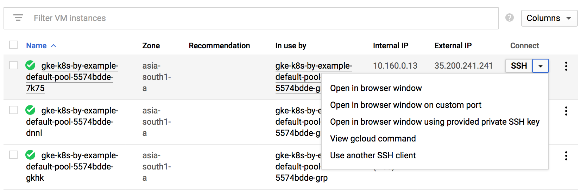

## Kubernetes By Example

This is a journal of me walking through the entire [Kubernetes By Example][1] exercises on `Google Kubernetes Engine`. Here's their [GitHub repository][2].

1. [Check config details](#check-config-details)
2. [Spin-up a k8s cluster (GKE)](#spin-up-a-k8s-cluster-(gke))
3. [Pods](#pods)
4. [Labels](#labels)
5. [Deployments](#deployments)
6. [Services](#services)
7. [Service Discovery](#service-discovery)

### Check config details
```sh
# List the active accounts:
$ gcloud auth list
   Credentialed Accounts
ACTIVE  ACCOUNT
*       xxyyzz@gmail.com

To set the active account, run:
    $ gcloud config set account `ACCOUNT`

# Checkout the project we are currently in
$ gcloud config list project 
[core]
project = kubernetes-practice-219913

Your active configuration is: [default]

# List the default/current config values (I wanted the zone and region details):
$ gcloud config configurations list
NAME     IS_ACTIVE  ACCOUNT               PROJECT                     DEFAULT_ZONE   DEFAULT_REGION
default  True       xxyyzz@gmail.com  kubernetes-practice-219913  asia-south1-a  asia-south1
```

### Spin-up a k8s cluster (GKE)

```sh
# Create a 3-node cluster and set kubectl context
$ gcloud container clusters create k8s-by-example --num-nodes=3

# Creating cluster k8s-by-example in asia-south1-a... Cluster is being health-checked (master is healthy)...done.                                              
# Created [https://container.googleapis.com/v1/projects/kubernetes-practice-219913/zones/asia-south1-a/clusters/k8s-by-example].
# To inspect the contents of your cluster, go to: https://console.cloud.google.com/kubernetes/workload_/gcloud/asia-south1-a/k8s-by-example?project=kubernetes-practice-219913

kubeconfig entry generated for k8s-by-example.
NAME            LOCATION       MASTER_VERSION  MASTER_IP       MACHINE_TYPE   NODE_VERSION  NUM_NODES  STATUS
k8s-by-example  asia-south1-a  1.11.7-gke.4    35.200.190.186  n1-standard-1  1.11.7-gke.4  3          RUNNING
```

Creating a GKE cluster using `gcloud` automatically makes an entry in the kubconfig file and also set the current context for `kubectl`.

### Pods

> A pod is a collection of containers sharing a network and mount namespace and is the basic unit of deployment in Kubernetes. All containers in a pod are scheduled on the same node.

A dry-run `kubectl run sise --image=mhausenblas/simpleservice:0.5.0 --port=9876 --dry-run=true -o yaml`, gives the following yaml output:

```yaml
apiVersion: apps/v1beta1
kind: Deployment
metadata:
  creationTimestamp: null
  labels:
    run: sise
  name: sise
spec:
  replicas: 1
  selector:
    matchLabels:
      run: sise
  strategy: {}
  template:
    metadata:
      creationTimestamp: null
      labels:
        run: sise
    spec:
      containers:
      - image: mhausenblas/simpleservice:0.5.0
        name: sise
        ports:
        - containerPort: 9876
        resources: {}
status: {}
```

Let's run the pod using the image `mhausenblas/simpleservice:0.5.0`:
```sh
$ kubectl run sise --image=mhausenblas/simpleservice:0.5.0 --port=9876
kubectl run --generator=deployment/apps.v1beta1 is DEPRECATED and will be removed in a future version. Use kubectl create instead.
deployment.apps/sise created

# List out the pod
$ kubectl get po -o wide
NAME                   READY   STATUS    RESTARTS   AGE   IP          NODE                                            NOMINATED NODE
sise-bf8d99689-qgkkk   1/1     Running   0          43s   10.12.1.6   gke-k8s-by-example-default-pool-f7f7edae-09cs   <none>

# Grab the IP address
$ kubectl describe pods sise-bf8d99689-qgkkk | grep IP
IP:                 10.12.1.6

# Get inside the pod and access the API using the IP address.
# This is accessible from the cluster as well
$ kubectl exec -it sise-bf8d99689-qgkkk sh
> curl localhost:9876/info
{"host": "localhost:9876", "version": "0.5.0", "from": "127.0.0.1"}# 

> curl 10.12.1.6:9876/info
{"host": "10.12.1.6:9876", "version": "0.5.0", "from": "10.12.1.6"}# 

# List the deployments
$ kubectl get deployments.
NAME   DESIRED   CURRENT   UP-TO-DATE   AVAILABLE   AGE
sise   1         1         1            1           20m

# And delete it
$ kubectl delete deployments sise
deployment.extensions "sise" deleted
```

#### Using a configuration file
```sh
# Apply a configuration to a resource by filename or stdin. The resource name must be specified. This resource will be created if it doesn't exist yet. JSON and YAML formats are accepted.
$ kubectl apply -f pod/pod.yaml
pod/twocontainers created

# List the pods
$ kubectl get pods -o wide
NAME            READY   STATUS    RESTARTS   AGE   IP          NODE                                            NOMINATED NODE
twocontainers   2/2     Running   0          1m    10.12.1.7   gke-k8s-by-example-default-pool-f7f7edae-09cs   <none>

# Get inside the container named 'shell' within the pod named 'twocontainers'
$ kubectl exec -it twocontainers -c shell -- bash
[root@twocontainers /]# curl localhost:9876/info
{"host": "localhost:9876", "version": "0.5.0", "from": "127.0.0.1"}

[root@twocontainers /]# curl 10.12.1.7:9876/info
{"host": "10.12.1.7:9876", "version": "0.5.0", "from": "10.12.1.7"}

# Clean up
$ kubectl delete pods twocontainers
pod "twocontainers" deleted
```

Creating pods with resource limits
```sh
# in the constraint-pod.yaml file:
      resources:
        limits:
          memory: "64Mi" 
          cpu: "500m"

# Create the pod
kubectl apply -f pod/constraint-pod.yaml

# List the pods
$ kubectl get pods
NAME                    READY   STATUS    RESTARTS   AGE
containers-constraint   1/1     Running   0          14m

# Clean up
$ kubectl delete pods containers-constraint
pod "containers-constraint" deleted
```

### Labels

> Labels are the mechanism you use to organize Kubernetes objects. A label is a key-value pair with certain restrictions concerning length and allowed values but without any pre-defined meaning.

```sh
# Create the pod using labels/labels-1.yaml
$ kubectl create -f labels/labels-1.yaml
pod/labelex created

# Check the pods created
$ kubectl get pods
NAME      READY   STATUS             RESTARTS   AGE
labelex   0/1     ImagePullBackOff   0          31s
```

Oops! Looks like I made some mistake while specifying the image for the container. Let me checkout what went wrong using the `describe` command:
```sh
$ kubectl describe pods labelex
Name:               labelex
Namespace:          default
Priority:           0
PriorityClassName:  <none>
Node:               gke-k8s-by-example-default-pool-41076e94-4n53/10.160.0.12
Start Time:         Fri, 15 Mar 2019 18:12:37 +0530
Labels:             env=development
Annotations:        <none>
Status:             Pending
IP:                 10.12.2.8
.
.
.
Events:
  Type     Reason          Age                   From                                                    Message
  ----     ------          ----                  ----                                                    -------
  Normal   Scheduled       5m10s                 default-scheduler                                       Successfully assigned default/labelex to gke-k8s-by-example-default-pool-41076e94-4n53
  Normal   SandboxChanged  5m1s (x2 over 5m3s)   kubelet, gke-k8s-by-example-default-pool-41076e94-4n53  Pod sandbox changed, it will be killed and re-created.
  Normal   Pulling         4m10s (x3 over 5m9s)  kubelet, gke-k8s-by-example-default-pool-41076e94-4n53  pulling image "mhausenblas/simpleservice:0.5."
  Warning  Failed          4m5s (x3 over 5m4s)   kubelet, gke-k8s-by-example-default-pool-41076e94-4n53  Failed to pull image "mhausenblas/simpleservice:0.5.": rpc error: code = Unknown desc = Error response from daemon: manifest for mhausenblas/simpleservice:0.5. not found
  Warning  Failed          4m5s (x3 over 5m4s)   kubelet, gke-k8s-by-example-default-pool-41076e94-4n53  Error: ErrImagePull
  Normal   BackOff         3m26s (x7 over 5m2s)  kubelet, gke-k8s-by-example-default-pool-41076e94-4n53  Back-off pulling image "mhausenblas/simpleservice:0.5."
  Warning  Failed          3s (x19 over 5m2s)    kubelet, gke-k8s-by-example-default-pool-41076e94-4n53  Error: ImagePullBackOff
```

Skimming through the `Events` section I found:

`Failed to pull image "mhausenblas/simpleservice:0.5.": rpc error: code = Unknown desc = Error response from daemon: manifest for mhausenblas/simpleservice:0.5. not found`


Lol! I mentioned the wrong image name(`mhausenblas/simpleservice:0.5.` instead of `mhausenblas/simpleservice:0.5.0`). Let me correct that and apply the changes:

```sh
# This time the image is successfully pulled
$ kubectl describe pods labelex
# Events:
#  Type     Reason          Age                   From                                                    Message
#   ----     ------          ----                  ----                                                    -------
#  Normal   Pulled          68s                   kubelet, gke-k8s-by-example-default-pool-41076e94-4n53  Successfully pulled image "mhausenblas/simpleservice:0.5.0"

# List the pod created
$ kubectl get pods
NAME      READY   STATUS    RESTARTS   AGE
labelex   1/1     Running   0          11m

# Show the labels as well
$ kubectl get pods --show-labels
NAME      READY   STATUS    RESTARTS   AGE   LABELS
labelex   1/1     Running   0          15m   env=development

# Filter by the label now
$ kubectl get pods -l env=development
NAME      READY   STATUS    RESTARTS   AGE
labelex   1/1     Running   0          16m

# Add a label to the pod
$ kubectl label pods labelex ownwer=bensooraj
pod/labelex labeled

# List them out again
$ kubectl get pods --show-labels
NAME      READY   STATUS    RESTARTS   AGE   LABELS
labelex   1/1     Running   0          17m   env=development,ownwer=bensooraj

# Filter by the new label.
$ kubectl get pods --selector ownwer=bensooraj
NAME      READY   STATUS    RESTARTS   AGE
labelex   1/1     Running   0          19m

```
I am really sorry for the spelling mistake with the label `ownwer=bensooraj`. It hurts my eyes.

Anyways, `--selector` and `-l` mean the same thing.

#### Set based selectors

> Kubernetes objects also support set-based selectors

We will launch another pod that has two labels (env=production and owner=bensooraj)
```sh
# Create a new pod using labels/labels-2.yaml
$ kubectl apply -f labels/labels-2.yaml

# List out all the pods along with the labels
$ kubectl get pods --show-labels
NAME       READY   STATUS    RESTARTS   AGE   LABELS
labelex    1/1     Running   0          57m   env=development,ownwer=bensooraj
labelex2   1/1     Running   0          2m    env=production,owner=bensooraj

# Let's get fancy here with selecting the labels
$ kubectl get pods --show-labels -l 'env in (development)'
NAME      READY   STATUS    RESTARTS   AGE   LABELS
labelex   1/1     Running   0          57m   env=development,ownwer=bensooraj

# The following lists all pods that are either labelled with env=development or with env=production
$ kubectl get pods --show-labels -l 'env in (development, production)'
NAME       READY   STATUS    RESTARTS   AGE   LABELS
labelex    1/1     Running   0          57m   env=development,ownwer=bensooraj
labelex2   1/1     Running   0          3m    env=production,owner=bensooraj
```

I can even delete pods like that:
```sh
$ kubectl delete pods -l 'env in (development, production)'
pod "labelex" deleted
pod "labelex2" deleted

# You can see them getting terminated
$ kubectl get pods -w
NAME       READY   STATUS        RESTARTS   AGE
labelex    1/1     Terminating   0          61m
labelex2   1/1     Terminating   0          6m34s
```

### Deployments

> A deployment is a supervisor for pods, giving you fine-grained control over how and when a new pod version is rolled out as well as rolled back to a previous state.

```sh
# Create a deploment called sise-deploy using 
$ kubectl apply -f deployments/deployment-1.yaml
deployment.apps/sise-deployment created

# The deployment has started creating the pods
$ kubectl get pods
NAME                               READY   STATUS              RESTARTS   AGE
sise-deployment-6b9688f8f5-8xgr4   0/1     ContainerCreating   0          25s
sise-deployment-6b9688f8f5-cwlvc   0/1     ContainerCreating   0          25s

# After a while
$ kubectl get pods
NAME                               READY   STATUS    RESTARTS   AGE
sise-deployment-6b9688f8f5-8xgr4   1/1     Running   0          63s
sise-deployment-6b9688f8f5-cwlvc   1/1     Running   0          63s

# Check the deployment as well
$ kubectl get deployments -o wide
NAME              DESIRED   CURRENT   UP-TO-DATE   AVAILABLE   AGE   CONTAINERS   IMAGES                            SELECTOR
sise-deployment   2         2         2            2           3m    sise         mhausenblas/simpleservice:0.5.0   app=sise

# List out the replica sets 
$ kubectl get rs -o wide
NAME                         DESIRED   CURRENT   READY   AGE   CONTAINERS   IMAGES                            SELECTOR
sise-deployment-6b9688f8f5   2         2         2       4m    sise         mhausenblas/simpleservice:0.5.0   app=sise,pod-template-hash=2652449491
```
> Note the naming of the pods and replica set, derived from the deployment name.

Check the app using the pod IPs
```sh
# Get the pod IPs
$ kubectl describe pod sise-deployment-6b9688f8f5-8xgr4 | grep IP
IP:                 10.12.1.6

$ kubectl describe pod sise-deployment-6b9688f8f5-cwlvc | grep IP
IP:                 10.12.2.5
```

SSH into one of the nodes of the cluster: 
* Navigate to `GCE > Compute Engine > VM instances`. Select one of the nodes
* Under the `Connect` (against any one of the nodes), click on the `SSH` drop-down and select `View gcloud command` as shown below:

* You will be presented with a command similar to: `gcloud compute --project "kubernetes-practice-219913" ssh --zone "asia-south1-a" "gke-k8s-by-example-default-pool-5574bdde-7k75"`

```sh
# From within the cluster, access the app running inside the pods
Bensooraj@gke-k8s-by-example-default-pool-5574bdde-7k75 ~ $ curl 10.12.1.6:9876/info
{"host": "10.12.1.6:9876", "version": "0.9", "from": "10.160.0.13"}

Bensooraj@gke-k8s-by-example-default-pool-5574bdde-7k75 ~ $ curl 10.12.2.5:9876/info
{"host": "10.12.2.5:9876", "version": "0.9", "from": "10.160.0.13"}
```

Rolling out an update
```sh
# Update the value of the environment variable SIMPLE_SERVICE_VERSION from "0.9" to "1.0"
$ kubectl apply -f deployments/deployment-2.yaml
deployment.apps/sise-deployment configured

# You can see the roll-out happening
$ kubectl get pods -w
NAME                               READY   STATUS        RESTARTS   AGE
sise-deployment-6b9688f8f5-8xgr4   1/1     Terminating   0          41m
sise-deployment-6b9688f8f5-cwlvc   1/1     Terminating   0          41m
sise-deployment-6c7b7f88c5-8mwr2   1/1     Running       0          16s
sise-deployment-6c7b7f88c5-zxfgm   1/1     Running       0          18s

# After a while
$ kubectl get pods
NAME                               READY   STATUS    RESTARTS   AGE
sise-deployment-6c7b7f88c5-8mwr2   1/1     Running   0          2m
sise-deployment-6c7b7f88c5-zxfgm   1/1     Running   0          2m

# Check out the replication set as well. A new replication set will be created
$ kubectl get rs -w
NAME                         DESIRED   CURRENT   READY   AGE
sise-deployment-6b9688f8f5   0         0         0       42m
sise-deployment-6c7b7f88c5   2         2         2       57s

# Check out the roll-out status
$ kubectl rollout status deployment sise-deployment
deployment "sise-deployment" successfully rolled out
```
Remember, the value change can also be rolled out using the command: `kubectl edit deploy sise-deployment`.


Verify the change made to the value of the environment variable by pinging the app
```sh
# Get the new set of pod IPs
j$ kubectl describe pods sise-deployment-6c7b7f88c5-8mwr2 | grep IP
IP:                 10.12.2.6

$ kubectl describe pods sise-deployment-6c7b7f88c5-zxfgm | grep IP
IP:                 10.12.1.7

# Curl the IPs from the node we SSHed into above
Bensooraj@gke-k8s-by-example-default-pool-5574bdde-7k75 ~ $ curl 10.12.2.6:9876/info
{"host": "10.12.2.6:9876", "version": "1.0", "from": "10.160.0.13"}

Bensooraj@gke-k8s-by-example-default-pool-5574bdde-7k75 ~ $ curl 10.12.1.7:9876/info
{"host": "10.12.1.7:9876", "version": "1.0", "from": "10.160.0.13"}
```

Undo the roll-out
```sh
# Check-out the roll-out history
$ kubectl rollout history deployment sise-deployment
deployment.extensions/sise-deployment 
REVISION  CHANGE-CAUSE
1         <none>
2         <none>

# Undo the roll-out
$ kubectl rollout undo deployment sise-deployment 
deployment.extensions/sise-deployment

# The roll-back has begun
$ kubectl get pods -o wide -w
NAME                               READY   STATUS        RESTARTS   AGE   IP          NODE                                            NOMINATED NODE
sise-deployment-6b9688f8f5-74fnz   1/1     Running       0          8s    10.12.2.7   gke-k8s-by-example-default-pool-5574bdde-gkhk   <none>
sise-deployment-6b9688f8f5-gglnk   1/1     Running       0          10s   10.12.1.8   gke-k8s-by-example-default-pool-5574bdde-dnnl   <none>
sise-deployment-6c7b7f88c5-8mwr2   1/1     Terminating   0          13m   10.12.2.6   gke-k8s-by-example-default-pool-5574bdde-gkhk   <none>
sise-deployment-6c7b7f88c5-zxfgm   1/1     Terminating   0          13m   10.12.1.7   gke-k8s-by-example-default-pool-5574bdde-dnnl   <none>

# List the roll-out history one more time
$ kubectl rollout history deployment sise-deployment
deployment.extensions/sise-deployment 
REVISION  CHANGE-CAUSE
2         <none>
3         <none>

# Get the new IP addresses
$ kubectl describe pods sise-deployment-6b9688f8f5-74fnz | grep IP
IP:                 10.12.2.7

$ kubectl describe pods sise-deployment-6b9688f8f5-gglnk | grep IP
IP:                 10.12.1.8

# Ping the app again from withing the cluster
Bensooraj@gke-k8s-by-example-default-pool-5574bdde-7k75 ~ $ curl 10.12.2.7:9876/info
{"host": "10.12.2.7:9876", "version": "0.9", "from": "10.160.0.13"}

Bensooraj@gke-k8s-by-example-default-pool-5574bdde-7k75 ~ $ curl 10.12.1.8:9876/info
{"host": "10.12.1.8:9876", "version": "0.9", "from": "10.160.0.13"}
```

You can see the version rolled-back from `"version": "1.0"` to `"version": "0.9"`.

Also, you can explicitly roll back to a specific revision using the flag `--to-revision`. For example: `kubectl rollout undo deployment sise-deployment`

Time to clean up!
```sh
$ kubectl delete deployment sise-deployment
deployment.extensions "sise-deployment" deleted

# Pods going down! :P
$ kubectl get pods -w
NAME                               READY   STATUS        RESTARTS   AGE
sise-deployment-6b9688f8f5-74fnz   1/1     Terminating   0          6m27s
sise-deployment-6b9688f8f5-gglnk   1/1     Terminating   0          6m29s
```

### Services

> A service is an abstraction for pods, providing a stable, so called virtual IP (`VIP`) address. While pods may come and go and with it their IP addresses, a service allows clients to reliably connect to the containers running in the pod using the VIP. The `virtual` in VIP means it is not an actual IP address connected to a network interface, but its purpose is purely to forward traffic to one or more pods. Keeping the mapping between the VIP and the pods up-to-date is the job of `kube-proxy`, a process that runs on every node, which queries the API server to learn about new services in the cluster.

Create the ReplicationController from `rc.yaml`:
```sh
$ kubectl apply -f services/rc.yaml

# Check the ReplicationController created
$ kubectl get replicationcontrollers -o wide
NAME      DESIRED   CURRENT   READY   AGE   CONTAINERS   IMAGES                            SELECTOR
rc-sise   2         2         2       50s   rc-sise      mhausenblas/simpleservice:0.5.0   app=rc-sise

# And the pods
$ kubectl get pod --show-labels -o wide
NAME            READY   STATUS    RESTARTS   AGE   IP          NODE                                            NOMINATED NODE   LABELS
rc-sise-24vg4   1/1     Running   0          1m    10.12.1.9   gke-k8s-by-example-default-pool-5574bdde-dnnl   <none>           app=rc-sise
rc-sise-dm4p8   1/1     Running   0          1m    10.12.2.8   gke-k8s-by-example-default-pool-5574bdde-gkhk   <none>           app=rc-sise
```

Create the Service from `svc.yaml`:
```sh
$ kubectl apply -f services/svc.yaml
service/simple-service created

# Get the service
$ kubectl get service -o wide
NAME             TYPE        CLUSTER-IP      EXTERNAL-IP   PORT(S)   AGE   SELECTOR
kubernetes       ClusterIP   10.15.240.1     <none>        443/TCP   3h    <none>
simple-service   ClusterIP   10.15.255.188   <none>        80/TCP    29s   app=rc-sise

# Get the pods
$ kubectl get pods -l app=rc-sise -o wide
NAME            READY   STATUS    RESTARTS   AGE   IP          NODE                                            NOMINATED NODE
rc-sise-24vg4   1/1     Running   0          7m    10.12.1.9   gke-k8s-by-example-default-pool-5574bdde-dnnl   <none>
rc-sise-dm4p8   1/1     Running   0          7m    10.12.2.8   gke-k8s-by-example-default-pool-5574bdde-gkhk   <none>

# Describe one of the pods and grab one of their IPs
$ kubectl describe pods rc-sise-24vg4 | grep IP
IP:                 10.12.1.9

# This can be accessed from one of three nodes running in the cluster
Bensooraj@gke-k8s-by-example-default-pool-5574bdde-7k75 ~ $ curl 10.12.1.9:9876/info
{"host": "10.12.1.9:9876", "version": "0.5.0", "from": "10.160.0.13"}
```

However, remember that pod IPs are ephemeral in nature and exist only as long as the pod exists. So, relying on pod IPs is not the right approach. 

> The service keeps track of the pods it forwards traffic to through the label, in our case `app=sise`.

Let's review the service that we created one more time:
```sh
$ kubectl get svc -o wide
NAME             TYPE        CLUSTER-IP      EXTERNAL-IP   PORT(S)   AGE   SELECTOR
kubernetes       ClusterIP   10.15.240.1     <none>        443/TCP   3h    <none>
simple-service   ClusterIP   10.15.255.188   <none>        80/TCP    6m    app=rc-sise

# Describe them
$ kubectl describe svc simple-service
Name:              simple-service
Namespace:         default
Labels:            <none>
Annotations:       kubectl.kubernetes.io/last-applied-configuration:
                     {"apiVersion":"v1","kind":"Service","metadata":{"annotations":{},"name":"simple-service","namespace":"default"},"spec":{"ports":[{"port":8...
Selector:          app=rc-sise
Type:              ClusterIP
IP:                10.15.255.188
Port:              <unset>  80/TCP
TargetPort:        9876/TCP
Endpoints:         10.12.1.9:9876,10.12.2.8:9876
Session Affinity:  None
Events:            <none>
```

Note that the `Endpoints` are actually pod IPs along with the port on which the application is running.

```sh
# The application can now be accessed using the clusterIP, from within the cluster
Bensooraj@gke-k8s-by-example-default-pool-5574bdde-7k75 ~ $ curl 10.15.255.188/info
{"host": "10.15.255.188", "version": "0.5.0", "from": "10.160.0.13"}
```

> [`IPtables`](https://wiki.centos.org/HowTos/Network/IPTables) makes the VIP `10.15.255.188` forward the traffic to the pods. `IPtables` is a long list of rules that tells the Linux kernel what to do with a certain IP package.

Let's check them out:
```sh
# From within the cluster, that is from within a node(vm) running in the cluster
Bensooraj@gke-k8s-by-example-default-pool-5574bdde-7k75 ~ $ sudo iptables-save | grep simple-service
-A KUBE-SEP-XKHKNSMBAPANOQ3H -s 10.12.1.9/32 -m comment --comment "default/simple-service:" -j KUBE-MARK-MASQ
-A KUBE-SEP-XKHKNSMBAPANOQ3H -p tcp -m comment --comment "default/simple-service:" -m tcp -j DNAT --to-destination 10.12.1.9:9876
-A KUBE-SEP-XRG5PL6H4OXP3HUZ -s 10.12.2.8/32 -m comment --comment "default/simple-service:" -j KUBE-MARK-MASQ
-A KUBE-SEP-XRG5PL6H4OXP3HUZ -p tcp -m comment --comment "default/simple-service:" -m tcp -j DNAT --to-destination 10.12.2.8:9876
-A KUBE-SERVICES ! -s 10.12.0.0/14 -d 10.15.255.188/32 -p tcp -m comment --comment "default/simple-service: cluster IP" -m tcp --dport 80 -j KUBE-MARK-MASQ
-A KUBE-SERVICES -d 10.15.255.188/32 -p tcp -m comment --comment "default/simple-service: cluster IP" -m tcp --dport 80 -j KUBE-SVC-LRSQWG6IZCA6IBBJ
-A KUBE-SVC-LRSQWG6IZCA6IBBJ -m comment --comment "default/simple-service:" -m statistic --mode random --probability 0.50000000000 -j KUBE-SEP-XKHKNSMBAPANOQ3H
-A KUBE-SVC-LRSQWG6IZCA6IBBJ -m comment --comment "default/simple-service:" -j KUBE-SEP-XRG5PL6H4OXP3HUZ
```

I have no clue how to read the above table, however, this is the `kube-proxy` defining rules to allow TCP connections back-n-forth the `ClusterIP` `10.15.255.188` and the pod IPs `10.12.1.9:9876` and `10.12.2.8:9876`.

Let's scale up our `ReplicationController`:
```sh
$ kubectl scale replicationcontroller --replicas=3 rc-sise
replicationcontroller/rc-sise scaled

# Check the pods
$ kubectl get pods --show-labels -o wide -w
NAME            READY   STATUS    RESTARTS   AGE   IP           NODE                                            NOMINATED NODE   LABELS
rc-sise-24vg4   1/1     Running   0          29m   10.12.1.9    gke-k8s-by-example-default-pool-5574bdde-dnnl   <none>           app=rc-sise
rc-sise-dm4p8   1/1     Running   0          29m   10.12.2.8    gke-k8s-by-example-default-pool-5574bdde-gkhk   <none>           app=rc-sise
rc-sise-p7sk9   1/1     Running   0          14s   10.12.1.10   gke-k8s-by-example-default-pool-5574bdde-dnnl   <none>           app=rc-sise
```

We have one more pod IP to handle, `10.12.1.10`.

And guess what? The service `simple-service` has already updated itself to account for the 3rd pod added to the `ReplicationController`.
```sh
# Check the Endpoints key. All the 3 pod IPs are now handled by the service
$ kubectl describe service simple-service 
Name:              simple-service
Namespace:         default
Labels:            <none>
Annotations:       kubectl.kubernetes.io/last-applied-configuration:
                     {"apiVersion":"v1","kind":"Service","metadata":{"annotations":{},"name":"simple-service","namespace":"default"},"spec":{"ports":[{"port":8...
Selector:          app=rc-sise
Type:              ClusterIP
IP:                10.15.255.188
Port:              <unset>  80/TCP
TargetPort:        9876/TCP
Endpoints:         10.12.1.10:9876,10.12.1.9:9876,10.12.2.8:9876
Session Affinity:  None
Events:            <none>
```

Let's also checkout the `IPtables` as well from within the cluster:
```sh
Bensooraj@gke-k8s-by-example-default-pool-5574bdde-7k75 ~ $ sudo iptables-save | grep simple-service
-A KUBE-SEP-O5OGXTSGDHX72GHE -s 10.12.1.10/32 -m comment --comment "default/simple-service:" -j KUBE-MARK-MASQ
-A KUBE-SEP-O5OGXTSGDHX72GHE -p tcp -m comment --comment "default/simple-service:" -m tcp -j DNAT --to-destination 10.12.1.10:9876
-A KUBE-SEP-XKHKNSMBAPANOQ3H -s 10.12.1.9/32 -m comment --comment "default/simple-service:" -j KUBE-MARK-MASQ
-A KUBE-SEP-XKHKNSMBAPANOQ3H -p tcp -m comment --comment "default/simple-service:" -m tcp -j DNAT --to-destination 10.12.1.9:9876
-A KUBE-SEP-XRG5PL6H4OXP3HUZ -s 10.12.2.8/32 -m comment --comment "default/simple-service:" -j KUBE-MARK-MASQ
-A KUBE-SEP-XRG5PL6H4OXP3HUZ -p tcp -m comment --comment "default/simple-service:" -m tcp -j DNAT --to-destination 10.12.2.8:9876
-A KUBE-SERVICES ! -s 10.12.0.0/14 -d 10.15.255.188/32 -p tcp -m comment --comment "default/simple-service: cluster IP" -m tcp --dport 80 -j KUBE-MARK-MASQ
-A KUBE-SERVICES -d 10.15.255.188/32 -p tcp -m comment --comment "default/simple-service: cluster IP" -m tcp --dport 80 -j KUBE-SVC-LRSQWG6IZCA6IBBJ
-A KUBE-SVC-LRSQWG6IZCA6IBBJ -m comment --comment "default/simple-service:" -m statistic --mode random --probability 0.33332999982 -j KUBE-SEP-O5OGXTSGDHX72GHE
-A KUBE-SVC-LRSQWG6IZCA6IBBJ -m comment --comment "default/simple-service:" -m statistic --mode random --probability 0.50000000000 -j KUBE-SEP-XKHKNSMBAPANOQ3H
-A KUBE-SVC-LRSQWG6IZCA6IBBJ -m comment --comment "default/simple-service:" -j KUBE-SEP-XRG5PL6H4OXP3HUZ
```

> ... the traffic to the service is equally split between the three pods by invoking the `statistics` module of `IPtables`.

I think the `--probability` does that.

Alrighty! Time to clean up:
```sh
$ kubectl delete replicationcontrollers rc-sise
replicationcontroller "rc-sise" deleted

$ kubectl delete svc simple-service
service "simple-service" deleted
```
I think it makes more sense to delete the `Service` first and then the `ReplicationController`. I will do that next time.

### Service Discovery

> Service discovery is the process of figuring out how to connect to a service. While there is a service discovery option based on environment variables available, the DNS-based service discovery is preferable. Note that DNS is a cluster add-on so make sure your Kubernetes distribution provides for one or install it yourself.

```sh
# Create the RC from service-discovery/rc.yaml
$ kubectl apply -f service-discovery/rc.yaml
replicationcontroller/rcsise created

# Check the pods
$ kubectl get pods -o wide 
NAME           READY   STATUS    RESTARTS   AGE   IP          NODE                                            NOMINATED NODE
rcsise-mgdc8   1/1     Running   0          56s   10.12.2.6   gke-k8s-by-example-default-pool-dec3a359-jsgl   <none>
rcsise-rwqxt   1/1     Running   0          56s   10.12.1.5   gke-k8s-by-example-default-pool-dec3a359-wrxk   <none>

# Create the service as well using service-discovery/svc.yaml
$ kubectl apply -f service-discovery/svc.yaml
service/thesvc created

# Check the service that we just created
$ kubectl get svc -o wide -w
NAME         TYPE        CLUSTER-IP      EXTERNAL-IP   PORT(S)   AGE    SELECTOR
kubernetes   ClusterIP   10.15.240.1     <none>        443/TCP   159m   <none>
thesvc       ClusterIP   10.15.241.194   <none>        80/TCP    11s    app=sise
```

[1]: http://kubernetesbyexample.com
[2]: https://github.com/openshift-evangelists/kbe